<div align="center">

# 🐒 TROOP

**SWING · SHOOT · OOK — a momentum-first multiplayer shooter in an infinite generated jungle**


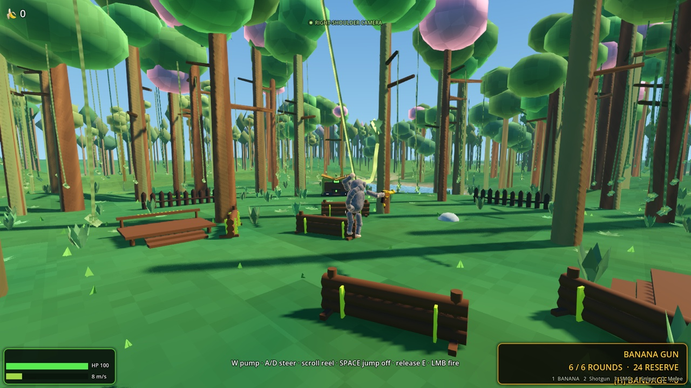

</div>

TROOP is a multiplayer movement shooter about being a monkey with somewhere to be.
Sprint on all fours through an endless jungle, grab a vine mid-flight, pump the
swing, and fling yourself over the canopy — then come down shooting a six-round
banana gun. The world is deterministic from a single seed: every player rebuilds
the identical jungle, and only what *changes* ever crosses the network. And there
is not one asset file in the project — every tree, monkey, gunshot, snowflake,
splash, and constellation is generated by code at runtime.

## Highlights

-  **An infinite jungle, four biomes deep** — Emerald Rainforest, Bamboo Grove,
  Flooded Wetland, and Cloud Highland, with rolling hills, macro lakes hundreds
  of metres across, and snow-capped mountain ranges above the tree line.
-  **Four fully simulated vehicles** — a 110 mph dual-sport motorcycle with
  real lean physics, a straight-six safari jeep on live axles with a
  low-range transfer case, an airboat that rides the actual wave field, and
  a 700 mph fighter jet with genuine lift/stall aerodynamics — all spawned
  deterministically in the world, all code-generated down to the fork
  sliders, and all replicated in multiplayer with one-driver seat claims.
-  **A seeded bush airstrip** — every world grades a 420 m packed-dirt runway
  and apron into its jungle (the seed search picks the flattest, driest
  corridor), with the jet parked and waiting.
-  **Fifteen-mile vistas on four LOD tiers** — interactive 48 m chunks, a
  672 m horizon ring, a ~1.9 km skyline tier, and an altitude-gated stratos
  tier: climb a peak (or fly) and the view stretches seamlessly to 24 km
  while fog, camera, and detail budgets scale to keep triple-digit FPS.
-  **Satellite minimap** — baked straight from the world generator like a
  Google-Maps tile layer (hillshade, depth-tinted water, snow), auto-zooms
  with altitude, shows every player with their name. M resizes, [ ] zoom.
-  **Physical vine swinging** — a real verlet pendulum: slack rope is free fall,
  the rope bends around trunks and unwinds again, grabs redirect your full
  momentum, and a perfectly timed taut release pays ×1.12.
-  **Four weapons with trick reloads** — banana gun, six-shell pump shotgun,
  20-round SMG, and a 215 m/s ballistic sniper zeroed at 75 m — each with a
  staged, sound-synchronized reload flourish and physical ejected debris.
-  **A fair AI rival** — Captain Peel plays through the exact same input surface
  a human does: no teleports, no aimbot, deliberately human-shaped misses.
-  **Chat, admin tools, and a debug playground** — ENTER opens text chat, a
  token-gated admin console (F8) spawns monkeys, grants gear, flies with angel
  wings, teleports, kicks, and temp-bans — plus **delivers any vehicle on the
  spot** (`/vehicle bike|jeep|boat|jet`) and **teleports to every vehicle
  spawn** (`/tp airstrip|pool|dock|machine`, the last one ring-scanning the
  jungle for the nearest hidden machine). A flat debug world offers block
  parkour, a rope garden, a regenerating robot range, and the vehicle yard.
-  **A living world** — a 60-minute day/night cycle that stays synced across the
  network, seasons that follow your real calendar (spring rain, summer fireflies,
  autumn leaves, winter snow and scarves), and clear nights with procedural
  constellations, planets, and a crisp cratered moon.
-  **Proximity voice chat** — hold-T push-to-talk with a 58 m spatial radius and
  a loss-proof custom ADPCM codec; the microphone is only live while T is held.
-  **Worldwide multiplayer** — one managed dedicated ENet authority on UDP
  30623. Players never host, forward ports, or expose a home computer.
-  **Self-updating** — RSA-signed release manifests, crash-safe two-phase
  content updates, automatic rollback, fully playable offline.

## What's new in 0.3 — THE VEHICLE UPDATE

- **Four drivable machines, simulated for real.** All four are rigid bodies
  with real mass, momentum, center of mass, and driver payload. The bike and
  jeep add raycast spring/damper/bumpstop suspension, load-sensitive slip-curve
  tires, and torque-curve engines with crank inertia, slipping clutches, and
  hysteresis-managed gearboxes; the airboat and jet use their own buoyancy,
  planing, thrust, lift, and drag simulations. Every visible part is generated
  by code, from compressing fork sliders to articulating landing gear.
  - **Dual-sport motorcycle** — a 650-class thumper that tops out at
    **110 mph** in a tuck. The rider banks it to the physically exact corner
    lean, camber thrust carves the turn, the head counter-rolls to keep the
    horizon level, wheelies rise under power (with an anti-loop instinct),
    and overcooking a slide lowsides the monkey into a tumble.
  - **Safari jeep** — straight-six torque, permanent 4WD with a
    SHIFT-toggled low-range transfer case, front-biased brakes, anti-roll
    bars, and visible live axles that articulate over rough ground. Holding
    S at a stop backs it up like every road car ever made.
  - **Airboat** — five buoyancy points ride the same CPU wave field the
    water shader displaces; the caged prop pushes it over lakes *and* wet
    grass (no underwater running gear to snag), with displacement-to-planing
    hull drag and prop-wash rudder authority from a standstill.
  - **Fighter jet** — a rebuilt tapered airframe, framed bubble canopy,
    detailed cockpit, and articulated tricycle gear, with **700 mph** at sea
    level held there by transonic wave drag. Real lift/AoA aerodynamics with a
    genuine stall, fly-by-wire that
    banks and pulls toward your camera aim under 9 g / 25° AoA limiters,
    retractable gear on oleo struts, flaps, an airbrake, and a spooling
    afterburner. Crashing it at speed is exactly as survivable as you think.
- **A seeded bush airstrip.** Each world searches its own noise fields for
  the flattest, driest corridor near spawn and grades a 420 m packed-dirt
  runway and apron into the jungle — trees, huts, and undergrowth make way,
  every LOD tier and the minimap agree, and the jet waits on the apron.
  A motor pool parks a bike and jeep by the duel arena, an airboat floats at
  the nearest lake dock, and rare wilderness machines hide in the deep
  jungle (about one per twenty chunks).
- **Vehicles are multiplayer citizens.** One-driver seat claims arbitrated by
  the server (exactly like supply chests), rider pose and machine attitude
  replicated in the existing state stream, resting positions synced to late
  joiners, and seats auto-released on disconnect. Protocol bumps to v5.
- **Riding looks and sounds right.** Each machine authors its real cushion,
  grip, pedal, and peg contacts, so the monkey visibly sits down with all four
  limbs planted, leans with the machine, and stows its weapon.
  Engine audio is synthesized per machine — thumper single, straight-six,
  prop drone, turbine whine with an afterburner bed — as seamless
  phase-locked loops pitch-tracked to the simulated RPM. A dashboard cluster
  shows speed, gear, and RPM, plus gear/flaps/altitude and a stall warning
  in the jet.
- **The jungle now reads to the horizon.** Tree silhouettes extend from the
  672 m horizon ring out to ~2.7 km on the skyline tier, and beyond that the
  terrain itself tints toward canopy color, so the 15-mile vista is unbroken
  forest instead of bare dirt — at *better* frame rates than 0.2.3
  (127 FPS vs 95 on the altitude benchmark, at full render scale).
- **macOS installs without the scary dialog.** The terminal one-liner now
  verifies the release checksum and strips quarantine itself, so the
  installed app opens straight from Finder. For fully warning-free DMGs, the
  build script can now sign with a Developer ID, notarize, and staple
  automatically when credentials are provided (see `packaging/README.md`).

## Screenshots

| 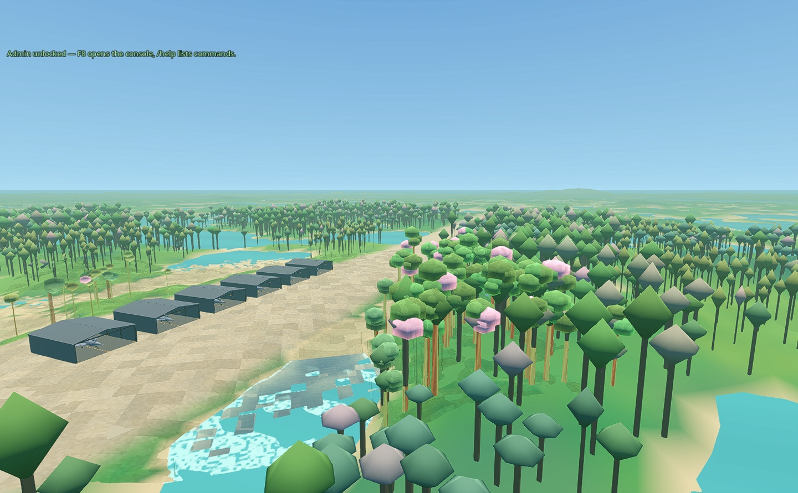 | 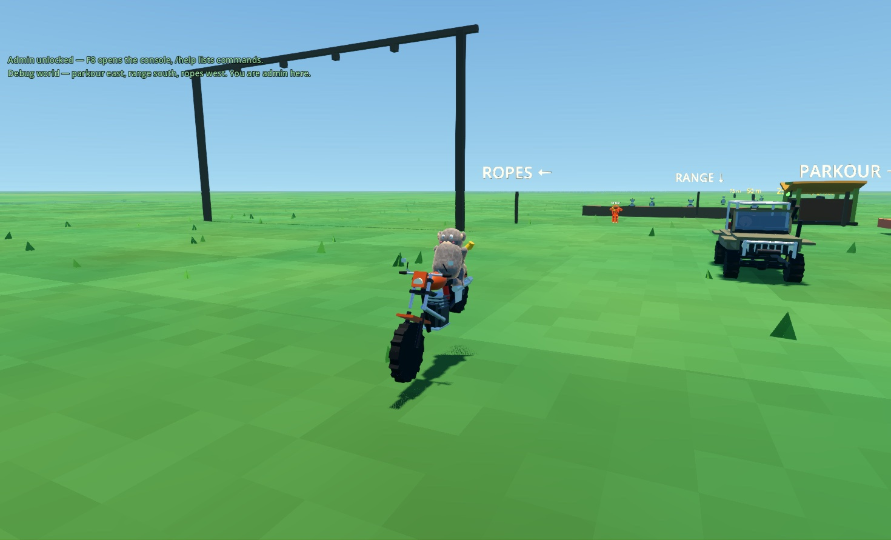 |
|:--:|:--:|
| *The seeded bush airstrip — a 420 m dirt runway carved through the jungle, jet waiting on the apron* | *Power wheelies are emergent physics: drive torque against the rear contact patch* |

| 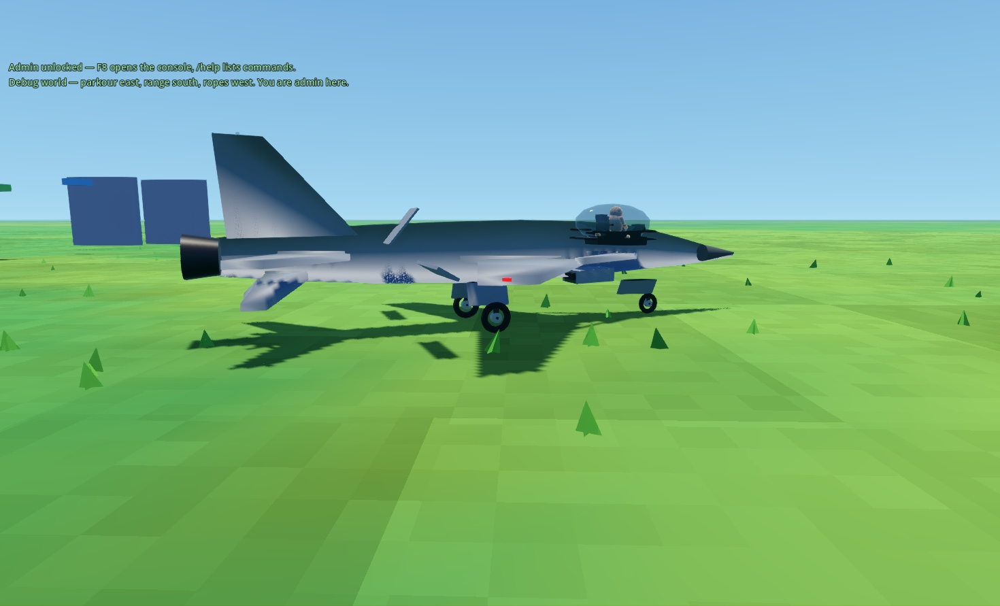 | 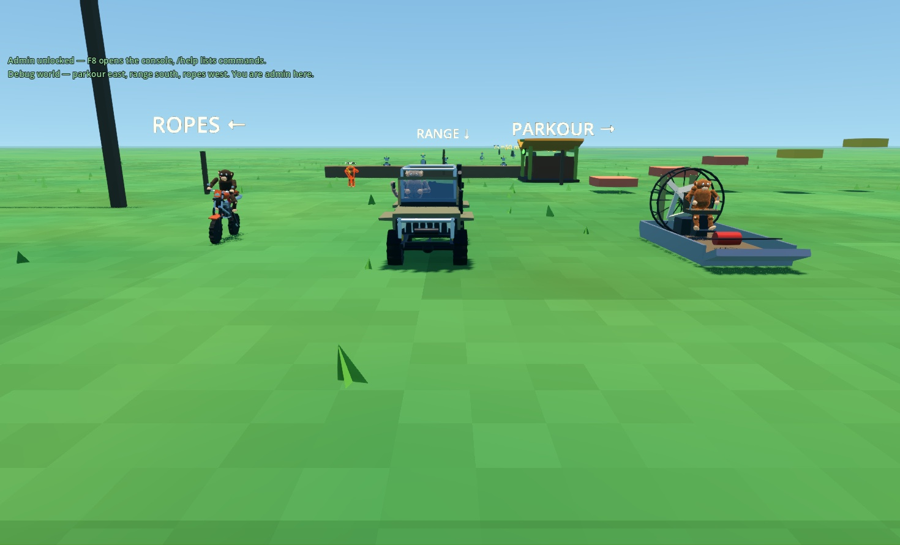 |
|:--:|:--:|
| *The rebuilt fighter: tapered airframe, hinged gear doors, detailed cockpit, and a pilot seated at its stick, throttle, and pedals* | *The 0.3 garage — every monkey sits on the real cushion with paws and feet anchored to authored controls and rests* |

| 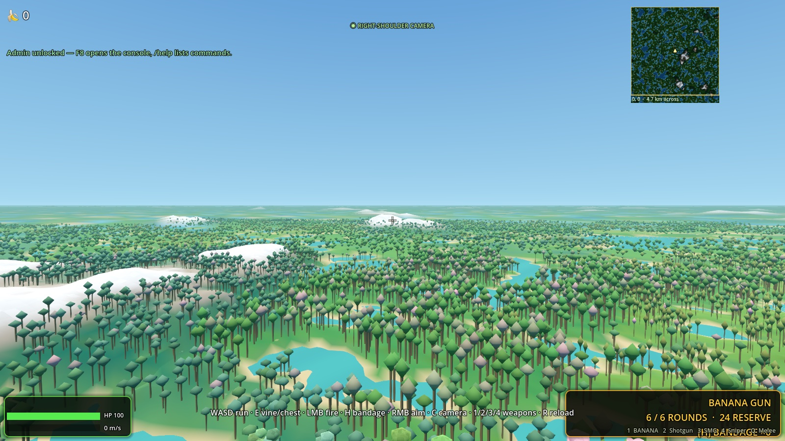 | 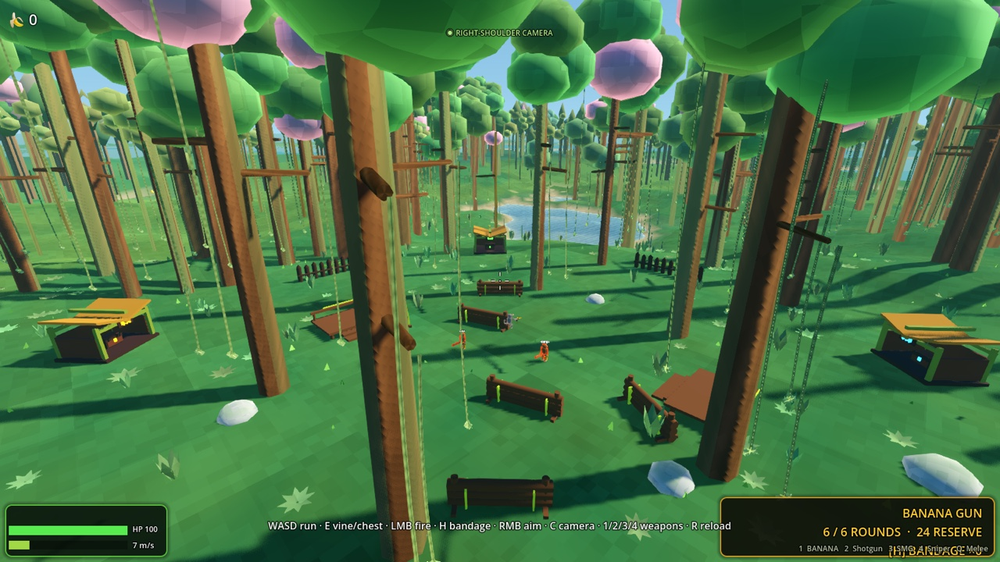 |
|:--:|:--:|
| *Trees now read to the full 15-mile horizon — silhouettes to ~2.7 km, canopy-tinted terrain beyond* | *The origin duel arena — barricades, palisades, and color-coded supply huts* |

| 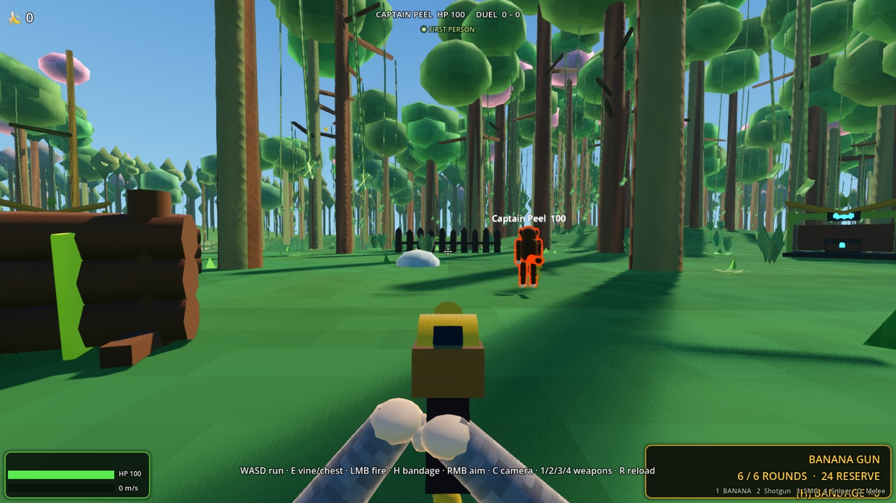 | 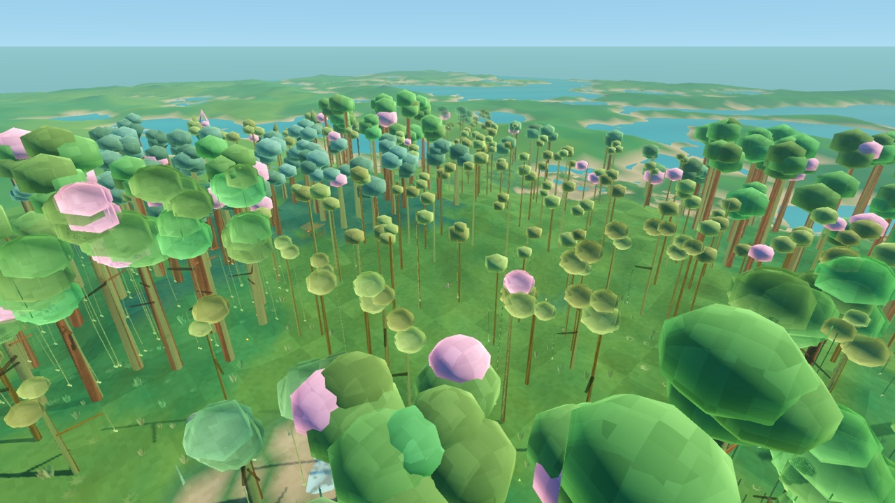 |
|:--:|:--:|
| *First-person duel against Captain Peel, the solo AI rival* | *Bamboo Grove, one of four biomes — lakes carved by domain-warped noise* |

| 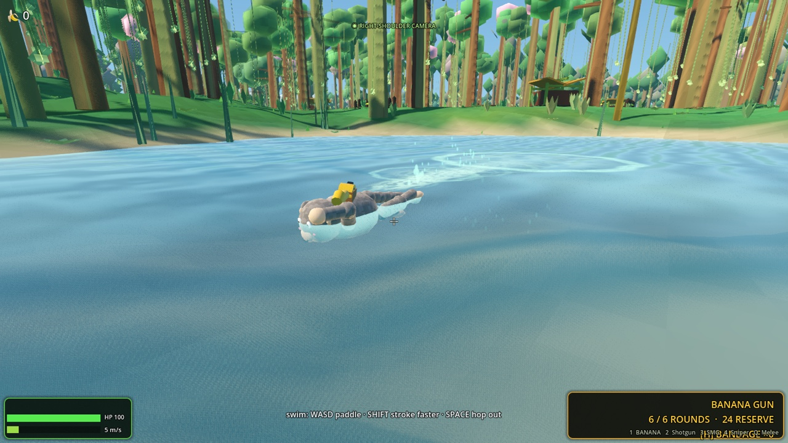 | 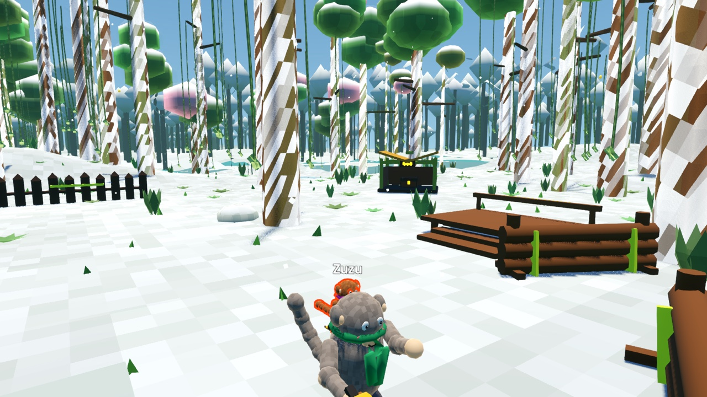 |
|:--:|:--:|
| *Deep water switches to a full freestyle stroke with a real wake* | *Winter follows your real calendar — and every monkey gets a scarf* |

| 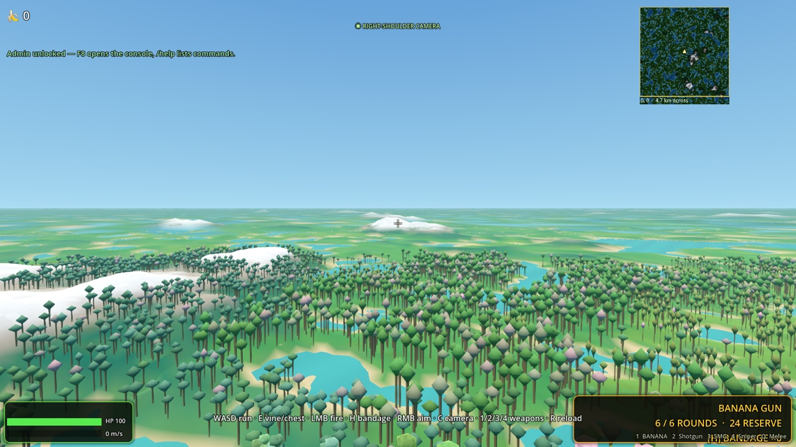 | 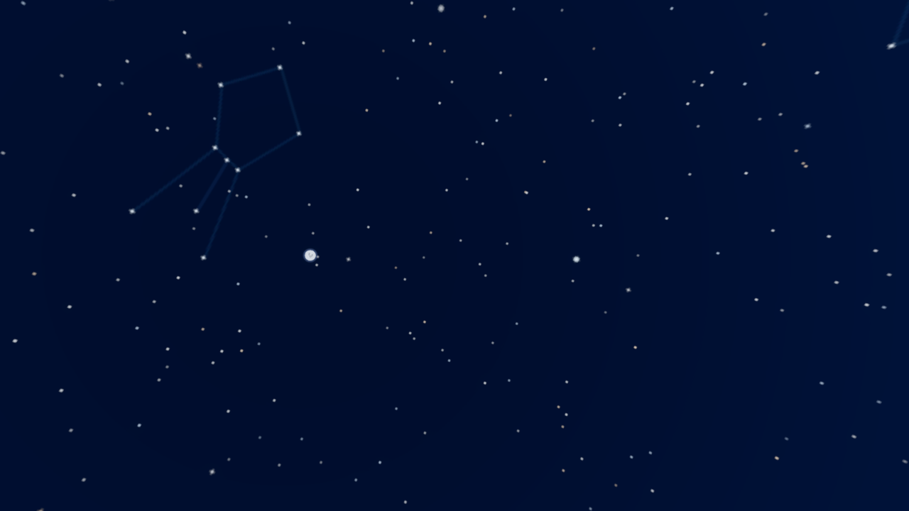 |
|:--:|:--:|
| *The 15-mile view from altitude — with the satellite minimap tracking it* | *Clear nights: ~900 stars, real constellations, planets, a cratered moon* |

## Debug world & admin tools

| 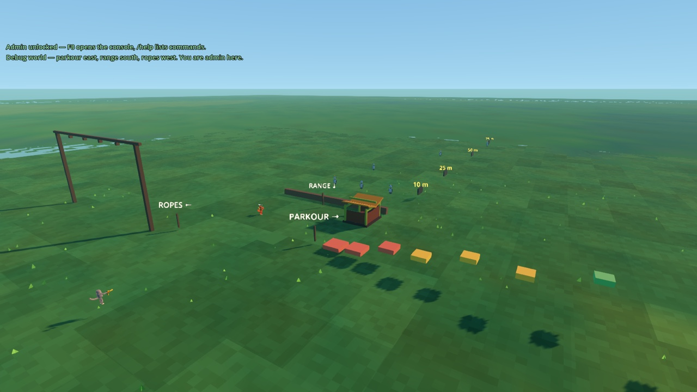 | 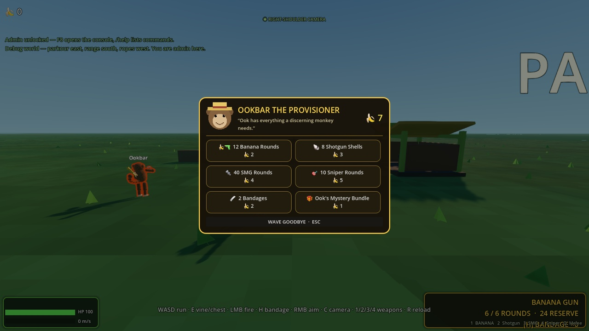 |
|:--:|:--:|
| *The debug world: parkour east, robot range south, rope garden west* | *Trade synced bananas for supplies at Ookbar's stall (E)* |

| 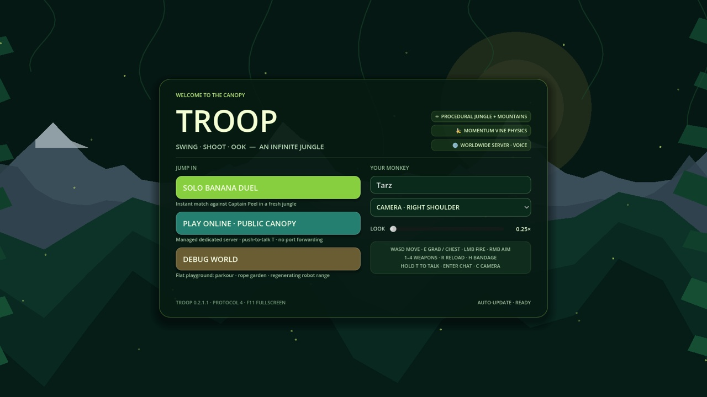 | 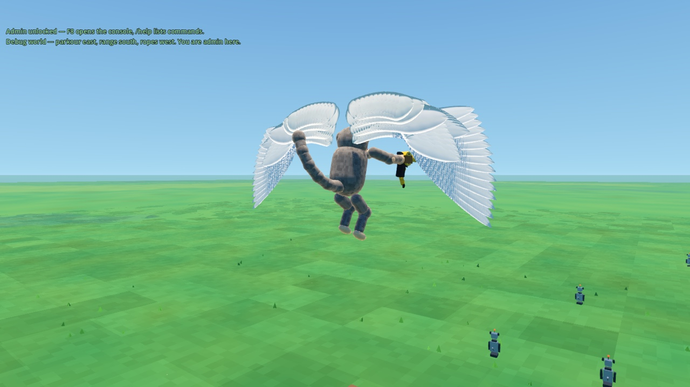 |
|:--:|:--:|
| *The redesigned menu — live auto-update status in the footer* | *Admin fly mode grows angel wings (`/fly` or the F8 console)* |

Solo and debug-world sessions are always admin. To be admin on a public
server, set `TROOP_ADMIN_TOKEN` on the server (for Fly:
`fly secrets set TROOP_ADMIN_TOKEN=<secret>`) and launch your client with
`TROOP_ADMIN_KEY=<same secret>`. Temp bans are by address, persist in
`user://bans.json` on the server, and banned players can still play solo.

## Play

```bash
godot --path .                         # source menu: solo + configured online service
TROOP_SERVER_HOST=game.example.com \
  godot --path . -- online             # development override for the public server
godot --headless --path . -- server    # dedicated authority used by managed hosting
```

Player releases expose **PLAY ONLINE · PUBLIC CANOPY**, which connects straight
to the managed worldwide server embedded by the release workflow. Players do
not host matches, forward router ports, or expose a home computer. Source builds
deliberately keep the endpoint blank; see `hosting/README.md` for the one-time
Fly and GitHub setup.

## Controls

| input | action |
|---|---|
| WASD + mouse | run / look |
| SHIFT | sprint on all fours with a gorilla-style quadrupedal gallop |
| SPACE | jump — double jump, wall-jump, and **jump off** a vine mid-swing |
| CTRL | slide on ground (keeps momentum, accelerates downhill) / **dive** in air |
| E | open a nearby supply chest, or **mount a nearby vehicle**; hold to grab the vine you're **looking at** when it's within realistic arm range (~1-3m) — a ring circles the targeted grab point; works mid-flight as you pass a strand |
| LMB | fire (hold for full-auto with the SMG) |
| RMB (hold) | aim in first person; the sniper enters its magnified optic |
| Z | cycle the sniper optic through 2.5× / 5× / 10× |
| Q | toggle melee mode — stow the weapon on the back; LMB chains a straight, hook, and two-paw hammer strike |
| C | toggle first person / collision-safe right-shoulder camera |
| 1 / 2 / 3 / 4 | switch between the banana gun, six-shell pump shotgun, 20-round SMG, and five-round sniper rifle |
| R | reload with a weapon-specific trick animation |
| H | use a bandage while grounded to restore 42 health; taking damage interrupts the wrap |
| W / S while swinging | pump the swing |
| A / D while swinging | steer the swing plane |
| scroll wheel | reel rope in / out — scroll up to shorten, down to lengthen |
| V | ook (everyone hears it) |
| T (hold) | push-to-talk proximity voice chat in online multiplayer |
| ENTER | open text chat — `/` prefixes admin commands (`/help`) |
| M | cycle minimap size (small / large / hidden) |
| [ / ] | minimap zoom out / in (auto-zooms with altitude) |
| F8 | admin console (when this session has admin) |
| ESC | release mouse |

**Behind the wheel / bars / stick** (E mounts, E dismounts — bail out of the
jet mid-air if you must):

| input | ground vehicles | fighter jet |
|---|---|---|
| W / S | bike/jeep throttle / brake (hold S stopped to reverse the jeep) · airboat fan / fan chop | throttle setpoint up / down |
| A / D | steer (the bike leans itself into the corner) | roll (nosewheel steering on the runway) |
| mouse | free look | **fly-by-wire pursuit** — the jet banks and pulls toward your aim, limited to 9 g / 25° AoA |
| SPACE | handbrake (bike: rear-brake slide) | airbrake |
| SHIFT | bike: tuck (that's where 110 mph lives) · jeep: low-range toggle | afterburner |
| CTRL | — | wheel brakes |
| G / F | — | landing gear / flaps |
| C | cycle chase / cockpit / front camera | same — front view never reverses the flight-control aim |

Flow loop: sprint → jump → dive → grab low → pump + reel → SPACE-fling at the
bottom of the arc → soar over the canopy → landing roll → slide → repeat.
Bananas float along swing arcs; collect them for score (synced).

## Online

Worldwide multiplayer uses a headless ENet authority on UDP **30623**. Clients
rebuild identical jungle geometry from its seed while the server validates and
relays players, projectiles, collectibles, supply-chest claims, and proximity
voice. Hold **T** for low-latency positional push-to-talk; microphone capture is
off whenever T is released. Voice volume and the PTT binding are configurable.

## Player installers & updates

Versioned Windows and macOS player packages are written to `dist/`. On a Mac
with Godot 4.7 export templates and NSIS installed, rebuild both with:

```bash
./packaging/build_installers.sh
```

See `packaging/README.md` for signing, notarization, and release notes.

**Update from the terminal** — replaces the installed game with the latest
release wherever it is installed (checksums verified; the game also updates
itself in-game, so this is mainly for repair or big engine jumps):

macOS:

```bash
curl -fsSL https://raw.githubusercontent.com/charlesjsantosgit/troop/main/packaging/update-troop.sh | bash
```

> **Skipping the macOS "couldn't verify" dialog** — the terminal command above
> verifies the release checksum itself and clears quarantine, so the installed
> app opens straight from Finder with no Gatekeeper warning and no trip to
> Privacy & Security. It also performs fresh installs. The browser-downloaded
> DMG still shows the dialog once because preview builds are not notarized;
> `packaging/README.md` documents the Developer ID + notarization flow that
> removes it from the DMG too.

Windows (PowerShell):

```powershell
powershell -c "irm https://raw.githubusercontent.com/charlesjsantosgit/troop/main/packaging/update-troop.ps1 | iex"
```

Release builds check a small RSA-signed manifest on GitHub Releases. Ordinary
script, scene, shader, and generated-content updates download as a compact Godot
resource pack, are re-verified on every boot, and take effect on the next
launch. Updates that change Godot itself, the updater bootstrap, native code, or
project settings instead offer the full Windows installer or macOS disk image.
The game remains fully playable when GitHub is offline.

<details>
<summary><b>🍃 Day, night, seasons, and weather</b></summary>

A complete 24-hour day/night cycle lasts 60 real minutes. Its shared clock stays
in sync in multiplayer, including for players who join a match already in
progress. A visible moon follows the same orbit as the moonlight, fades out in
daylight, and becomes muted by rainy or snowy weather. Clear nights fade into a
deep midnight-blue sky filled with varied stars, recognizable constellations,
and softly colored planets. The slightly enlarged moon has a crisp rim and
visible procedural crater shading rather than a featureless white glow.

The local calendar selects Northern Hemisphere seasons. Spring brings rain,
summer favors clear skies and nighttime fireflies, fall turns the leaves and
sends loose leaves through the air, and winter covers the jungle in falling snow
and gives every monkey a scarf.

</details>

<details>
<summary><b>🔫 Weapons and combat feel</b></summary>

The banana gun and SMG use a compact center-dot precision reticle. It stays exact
while stationary, opens slightly while moving, and blooms substantially during
one-handed vine fire. The shotgun ring includes both its pellet cone and the
same movement/swing error, with the current cone diameter and aim distance shown
below the crosshair.

Every firearm has a staged, sound-synchronized reload. The banana gun ejects a
curved banana magazine, flips a fresh one from the left paw, catches it, and
snaps it home. The SMG performs the same drop/flip/catch sequence before a
charging-handle rack; the sniper adds a heavy bolt flourish. The shotgun flips
each individual shell into the loading paw, inserts it through the port, then
finishes with an exaggerated pump. Fired SMG brass, shotgun hulls, sniper
casings, and discarded magazines become lightweight physical debris with
bounded impact sounds and automatic cleanup. Shared choreography and debris
helpers give future weapons the same event-timed reload foundation. Reload and
bandage presentation is replicated too, so other players see the prop handling
and healing pose.

Supply huts appear as moderately common clearings in the rainforest, bamboo,
and highland biomes. Their openable, host-authoritative chest contains ammo for
one weapon type and can also contain bandages. Chest contents and claimed state
are deterministic, persist through chunk streaming, and synchronize for late
joiners.

The sniper fires a 215 m/s physically falling projectile zeroed at 75 m. Body
hits remove 85 health and any head hit is lethal. Its scope supplies a live
range and holdover readout; the center dot turns red over an enemy and pulses
smaller over the head. Hip-fire spread is represented by the reticle exactly.
The rifle report includes a long spatial reverb tail and two restrained echoes.

Deep water automatically switches to freestyle swimming; steer with WASD and
hold SHIFT for a stronger stroke.

</details>

<details>
<summary><b>🏍️ Vehicle internals</b></summary>

- Every machine is a RigidBody3D with per-wheel raycast suspension: linear
  springs with asymmetric bump/rebound damping, an energy-absorbing
  progressive bumpstop over the last 15% of travel, and static sag placed at
  spawn so nothing ever drops onto its wheels.
- Tires run a simplified Pacejka model — `F = μ·Fz·sin(C·atan(B·slip))` on
  both axes — with per-wheel spin integration (4 substeps), so wheelspin,
  brake lockup, and engine braking emerge from the torque balance instead of
  being scripted. A friction ellipse couples the axes; tire load sensitivity
  softens peak grip under weight transfer; winter and submerged lakebeds cut
  surface grip.
- Drivetrains simulate a lerped torque curve, crank inertia, a slipping
  launch clutch, a rev limiter, and an auto box with shift torque-cut,
  post-shift lockout, and a landing-rpm guard so it never hunts. Driver
  traction control feathers the throttle past peak slip exactly like a good
  right hand.
- Wheel raycasts fall back to the analytic `Gen.height` field when chunk
  colliders haven't streamed yet, so a jet at 313 m/s can outrun the
  streaming ring without ever falling through the world.
- The motorcycle's balance is the *outcome* of counter-steering: a
  speed-scaled roll controller drives the machine to the kinematically exact
  corner lean `atan(v²/Rg)`, camber thrust pushes the contact patches around
  the corner, a "feet down" stabilizer holds it below walking pace, and
  sliding both patches past recovery lowsides the rider off. Pitch damping
  and an anti-loop throttle instinct shape wheelies; the forks and swingarm
  visually stroke with their wheels.
- The jet flies on `q = ½ρv²`: lift slope 3.8/rad to a 24° stall,
  induced + gear + flap + airbrake drag, and a wave-drag wall past Mach 0.88
  that pins sea-level top speed at ~313 m/s (700 mph). Static pitch/yaw
  stability, rate damping, and control-surface authority all scale with
  dynamic pressure; the FBW chases your camera aim through bank-to-pull with
  AoA and G limiters; ρ falls off with altitude on an 8.5 km scale height.
- The airboat samples the shared CPU wave function at five hull points for
  buoyancy with vertical damping, blends displacement drag into planing drag
  as it gets on step, steers with spool-scaled prop wash, and slides over
  land on a slick hull — thrust trimmed just below the CoM so power lifts
  the bow instead of plowing it.
- Engine loops are synthesized at boot from phase-locked harmonic stacks
  (every partial an integer multiple of the loop base, so the seam is
  mathematically silent) with soft-clip waveshaping for combustion growl;
  the turbine adds a crossfaded noise bed. Playback pitch-tracks simulated
  RPM per machine, with a separate afterburner layer on the jet.
- Vehicles piggyback on the player state stream (kind, id, and
  pitch/roll/rpm packed into one Vector3); seat claims and dismount resting
  transforms replicate through the same host-authoritative flow as supply
  chests, and late joiners receive both in the world snapshot.

</details>

<details>
<summary><b>🐵 Movement internals</b></summary>

- Momentum-first: overspeed from flings bleeds off gently instead of clamping.
- Coyote time (0.12s), jump buffering (0.14s), variable jump height.
- Swing is a verlet pendulum: constraint only applies when the rope is taut, so
  slack rope = free fall. Reeling in at the arc bottom does real work → speed.
- Grabbing never snap-flings: the rope starts at your current distance and the
  hands slide smoothly to the grabbed point; overstretch closes at a capped
  rate (9 m/s) instead of in a single frame.
- Vines collide with the world: the rope raycasts each tick and bends around
  trunks, branches, canopies and rocks via wrap pivots, shortening the swing
  radius — then unwinds when the arc opens back up. Wrap points replicate.
- The rope radius is where you grabbed the vine; the vine never shortens — the
  remainder trails below your grip as a physically simulated segment chain.
- Releasing a vine preserves its exact bent shape and momentum. The anchored
  strand keeps swinging under gravity, can be grabbed again while moving, and
  only returns to the static jungle mesh after it naturally settles.
- Grabs carry momentum: attaching redirects your full speed onto the new swing
  tangent, so chained vine-to-vine swings never dead-stop.
- Release gives ×1.12 when taut plus an upward pop on SPACE jump-off.
- The rig has articulated elbows and knees with visible joint caps. A swinging
  monkey holds the vine with its left paw and keeps its weapon raised in the
  right in both first and third person; unarmed swing poses can still use both
  paws. With the heavier sniper equipped, the tail coils around the rope and
  both legs brace against it while pumping/steering speed is reduced.
- Holding sprint transitions into a low, gorilla-style quadrupedal gallop. The
  procedural pose drives head stabilization, spine compression/extension,
  shoulder and hip roll, all four planted/recovery limbs, paw/foot alignment,
  and a full-width furred tail with a delayed counterbalancing wave. Fast vine
  landings flow into the same gait without a bipedal pop.
- Deep water uses a full-body freestyle cycle: alternating underwater pulls and
  high-elbow recoveries, breathing head turn, axial torso roll, six-beat flutter
  kick, articulated feet, and a trailing tail. Stroke power produces two small
  propulsion surges per cycle while buoyancy follows the rendered wave surface.
- Sprinting and swimming automatically stow the equipped weapon on the back. Q
  uses the same mount for a timed three-hit melee mode with first- and
  third-person attack animation.
- Grabbing hides the static vine and draws a live rope anchor→hand (replicated).
- The camera layers speed-scaled stride bob, lateral weight shift, acceleration
  inertia, airborne lag, vine pendulum banking, freestyle stroke heave, and a
  damped landing dip. Every component is bounded; sniper ADS hard-suppresses
  locomotion sway and projection shake so its center dot remains ballistic-exact.

</details>

<details>
<summary><b>🎨 Rendering and performance</b></summary>

- A collision-free 192 m macro-sector HLOD ring extends the generated horizon
  to 672 m (5.6× the old near edge). Its indexed terrain, clipped coarse water,
  and combined tree silhouettes use cheap dedicated shaders with no gameplay
  nodes or shadows; canonical tree positions match the full chunks that replace
  them as the player approaches.
- Four low-frequency biomes—Emerald Rainforest, Bamboo Grove, Flooded Wetland,
  and Cloud Highland—vary tree anatomy, trunk/canopy palette, undergrowth,
  rocks, fog, and ambience across coherent regions rather than per-tile patches.
- Warped macro basins make irregular lakes hundreds of metres across. Near
  shores retain the animated/refraction water and pooled ripple/splash system,
  while distant submerged cells use a much cheaper wave shader.
- Trees are submitted as four batched surfaces per chunk: cross-faded high and
  low trunk/canopy LODs replace thousands of individual tree draw calls.
- Ferns, broadleaf plants, wetland reeds, grass, vines, rocks, water and
  collectibles use batched meshes, distance ranges, and soft fades; distant LOD
  canopies stop casting shadows.
- Water combines layered directional waves, animated micro-normal detail,
  refraction, depth/Fresnel tinting, shore and crest foam, and pooled interactive
  ripple deformation. Entry, exit, paw-stroke, kick, wake, foam, and spray
  effects share the same CPU wave-height function as the shader and use
  synthesized spatial SFX.
- Only the two chunk rings around the player remain in the physics broadphase;
  the outer streamed ring is visual scenery until the player approaches.
- Near terrain shares an indexed 17×17 vertex lattice instead of emitting six
  duplicate vertices per cell, cutting each full chunk from 1,536 terrain
  vertices/height calls to 289 without changing collision boundaries.
- 3D resolution adapts gradually after sustained low frame rate, independently
  of the full-resolution HUD. At the lower tier it also disables SSIL and
  volumetric fog, shortens shadow distance, and reduces ambient particles.
- Shader materials are cached and shared, bananas are single batched meshes,
  water tessellation is distance-capped, and 3D uses lightweight FXAA.
- Seasonal color and snow coverage are shared shader parameters rather than
  rebuilt terrain or per-tree materials. Rain, leaves, and snow use bounded GPU
  particle fields whose density follows the same adaptive performance tiers.

</details>

<details>
<summary><b>🧪 Tests</b></summary>

```bash
godot --headless --path . res://scenes/main.tscn -- movetest
godot --headless --path . res://scenes/main.tscn --quit-after 6000 -- generationtest
godot --headless --path . res://scenes/main.tscn --quit-after 6000 -- seasontest
godot --headless --path . res://scenes/main.tscn --quit-after 6000 -- combattest
godot --headless --path . res://scenes/main.tscn --quit-after 6000 -- pausetest
godot --headless --path . res://scenes/main.tscn --quit-after 8000 -- entrytest
godot --headless --path . res://scenes/main.tscn --quit-after 6000 -- aitest
godot --headless --path . res://scenes/main.tscn --quit-after 20000 -- debugtest
godot --headless --path . res://scenes/main.tscn --quit-after 90000 -- vehicletest
godot --headless --path . res://scenes/main.tscn --quit-after 40000 -- vehicleworldtest
godot --headless --path . --script res://tests/voicetest.gd
godot --headless --path . --script res://tests/netsecuritytest.gd
godot --headless --path . --script res://tests/updatetest.gd
godot --resolution 1600x900 --max-fps 0 --path . res://scenes/main.tscn -- perftest
godot --resolution 1600x900 --max-fps 0 --path . res://scenes/main.tscn -- perftest spring
godot --resolution 1600x900 --max-fps 0 --path . res://scenes/main.tscn -- perftest summer
godot --resolution 1600x900 --max-fps 0 --path . res://scenes/main.tscn -- perftest winter
godot --resolution 1600x900 --max-fps 0 --path . res://scenes/main.tscn -- perftest night
godot --resolution 1600x900 --max-fps 0 --path . res://scenes/main.tscn -- perftest altitude
# two-terminal multiplayer check:
godot --headless --path . res://scenes/main.tscn --quit-after 4000 -- nettest-host
godot --headless --path . res://scenes/main.tscn --quit-after 4000 -- nettest-join 127.0.0.1
# dedicated-server startup check:
TROOP_BIND_IP=127.0.0.1 godot --headless --path . \
  res://scenes/main.tscn --quit-after 30 -- server
# three-terminal dedicated voice relay check (use the same free port):
godot --headless --path . --script res://tests/voice_relay_fixture.gd -- server 30626
godot --headless --path . --script res://tests/voice_relay_fixture.gd -- receiver 30626
godot --headless --path . --script res://tests/voice_relay_fixture.gd -- sender 30626
# screenshots (needs a window):
godot --path . res://scenes/main.tscn -- shot vista /tmp/vista.png
godot --path . res://scenes/main.tscn -- shot swing /tmp/swing.png
godot --path . res://scenes/main.tscn -- shot pause-menu /tmp/pause-menu.png
godot --path . res://scenes/main.tscn -- shot pause-settings /tmp/pause-settings.png
godot --path . res://scenes/main.tscn -- shot pause-controls /tmp/pause-controls.png
# forced seasonal and lighting fixtures (independent of the current month/time):
godot --path . res://scenes/main.tscn -- shot season-autumn /tmp/autumn.png
godot --path . res://scenes/main.tscn -- shot season-winter /tmp/winter.png
godot --path . res://scenes/main.tscn -- shot winter-scarf /tmp/scarf.png
godot --path . res://scenes/main.tscn -- shot lighting-night /tmp/night.png
godot --path . res://scenes/main.tscn -- shot lighting-moon /tmp/moon.png
godot --path . res://scenes/main.tscn -- shot lighting-celestial /tmp/celestial.png
godot --path . res://scenes/main.tscn -- shot lighting-celestial-rain /tmp/celestial-rain.png
godot --path . res://scenes/main.tscn -- shot lighting-moon-detail /tmp/moon-detail.png
# reload/healing/hut visual fixtures:
godot --path . res://scenes/main.tscn -- shot reload-banana /tmp/reload.png
godot --path . res://scenes/main.tscn -- shot bandage /tmp/bandage.png
godot --path . res://scenes/main.tscn -- shot supply-hut /tmp/supply-hut.png
godot --path . res://scenes/main.tscn -- shot mountains /tmp/mountains.png
godot --path . res://scenes/main.tscn -- shot airstrip /tmp/airstrip.png
godot --path . res://scenes/main.tscn -- shot debug-vehicles /tmp/vehicles.png
godot --path . res://scenes/main.tscn -- shot debug-jet /tmp/jet.png
godot --path . res://scenes/main.tscn -- shot debug-ride /tmp/ride.png
# deterministic two-second locomotion frame review (play, first, side, or front):
godot --resolution 960x540 --path . res://scenes/main.tscn -- shot clip-sprint-first /tmp/sprint.png
godot --resolution 960x540 --path . res://scenes/main.tscn -- shot clip-swim-first /tmp/swim.png
ffmpeg -framerate 15 -i /tmp/sprint_%02d.png -c:v libx264 -pix_fmt yuv420p /tmp/sprint.mp4
ffmpeg -framerate 15 -i /tmp/swim_%02d.png -c:v libx264 -pix_fmt yuv420p /tmp/swim.mp4
# sniper optic/fire, hip-spread/fire, plus side/front rope-handling review:
godot --path . --write-movie /tmp/sniper-scope.ogv --fixed-fps 15 res://scenes/main.tscn -- shot clip-sniper-scope /tmp/sniper-scope.png
godot --path . --write-movie /tmp/sniper-hip.ogv --fixed-fps 15 res://scenes/main.tscn -- shot clip-sniper-hip /tmp/sniper-hip.png
godot --path . --write-movie /tmp/sniper-rope-side.ogv --fixed-fps 15 res://scenes/main.tscn -- shot clip-sniper-rope-side /tmp/sniper-rope-side.png
godot --path . --write-movie /tmp/sniper-rope-front.ogv --fixed-fps 15 res://scenes/main.tscn -- shot clip-sniper-rope-front /tmp/sniper-rope-front.png
```

The rendered benchmark keeps an eight-second shader/streaming warmup, measures
eight seconds of active sprinting and solo combat, then measures a bounded
two-second live summer-to-spring weather transition. It exits nonzero unless
both samples sustain at least 60 average FPS, keep p95 at or below 25 ms, keep
the worst frame below 100 ms, and produce no frame above 100 ms.

</details>
