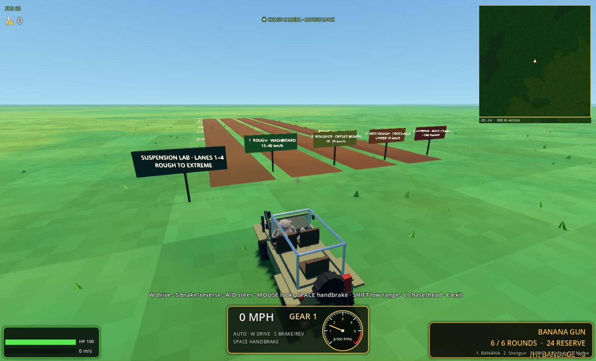
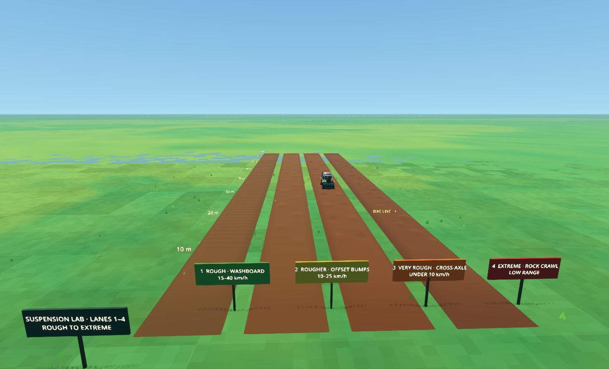

<div align="center">

# 🐒 TROOP

**SWING · SHOOT · OOK — a momentum-first multiplayer shooter on a generated planet**


</div>

TROOP is a multiplayer movement shooter about being a monkey with somewhere to be.
Sprint on all fours through the jungle, grab a vine mid-flight, pump the
swing, and fling yourself over the canopy — then come down shooting a six-round
banana gun. The world is deterministic from a single seed: every player rebuilds
the identical jungle, and only what *changes* ever crosses the network. Gameplay
geometry, actors, effects, and simulation remain generated by code at runtime;
the planetary presentation now pairs that data with dedicated 4K Earth and Moon
textures for readable globe and voyage views.

## Highlights

- **Shared Roots & Rockets societies** — choose **PLAY ONLINE · SHARED TOWNS**
  for three Earth towns and three Moon towns with persistent owners, personal
  bags, finite markets, working citizens and vehicle deliveries. Claim one town
  for 750 credits; visitors can still shop and do requests. **E** opens the nearby
  person's or workplace's menu. **B → Tutorial** offers four guided lessons.
  The separate offline career preserves existing saves.
  See the [shared society guide](docs/SHARED_SOCIETIES.md).
- **Photographic lunar astronomy** — a credited ESO sky panorama, NASA Earth
  imagery and constellation guides, with seven planetary targets and an
  observation exposure mode. The visible Sun also drives lunar lighting;
  distance-independent crater relief remains readable beyond nearby shadows.
  [Image sources and astronomical limits](assets/astronomy/ATTRIBUTION.md).

-  **A complete Earth-like world, twelve biomes deep** — a connected Pangaea
  supercontinent on a 40,077,312 m circumference sphere, offshore islands, huge
  oceans, freshwater lakes, rainforest, bamboo, wetlands, highlands,
  plains, grasslands, desert, rocky mountains, tundra, and polar ice. Broad
  uplifts replace noisy terrain bumps: major mountain country averages roughly
  1,200 m and the tallest seed-derived summit reaches exactly 6,000 m.
-  **Four fully simulated vehicles** — a 110 mph dual-sport motorcycle with
  real lean physics, a straight-six safari jeep on live axles with a
  low-range transfer case, an airboat that rides the actual wave field, and
  a 700 mph fighter jet with genuine lift/stall aerodynamics — all spawned
  deterministically in the world, all code-generated down to the fork
  sliders, and all replicated in multiplayer with one-driver seat claims.
-  **A seeded bush airfield** — every world grades a 1,260 m packed-dirt runway
  and six-bay hangar hardstand into its jungle (the seed search samples the
  full corridor), with a usable fighter jet parked inside every hangar.
-  **Fifteen-mile vistas on four LOD tiers** — interactive 48 m chunks, a
  672 m horizon ring, a ~1.9 km skyline tier, and an altitude-gated stratos
  tier: climb a peak (or fly) and the view stretches seamlessly to 24 km
  while fog, camera, and detail budgets scale to keep triple-digit FPS.
-  **Minimap + planetary atlas** — M keeps a satellite minimap of the current
  dimension: Earth's terrain or the Moon's spherical crater surface, with lunar
  farm, trader, cellar, oxygen, crystal and landing-pad markers. It follows the
  player around the whole Moon and hides during transit. Meanwhile,
  X opens a smooth full-screen map generated from the exact terrain, canopy,
  water, biome, and road fields. Pan and zoom from a local player-facing map to
  the whole atmospheric globe, with live named player arrows, then select the
  Moon beside it as a travel destination.
-  **A four-monkey Moon expedition** — board a physical rocket, watch Earth
  recede during a 60-second outbound flight, land under 1.62 m/s²
  gravity in a pressure suit, refill oxygen at the ship, and buy Moon Cheese
  from Muenster, an animated lunar merchant who patrols, greets visitors,
  and reacts to trades. The fiery 45-second return lands vertically on the
  original Earth launchpad. After a three-second engine shutdown, press E to
  leave the cabin; the rocket stays ready for another expedition.
-  **Physical vine swinging** — a real verlet pendulum: slack rope is free fall,
  the rope bends around trunks and unwinds again, grabs redirect your full
  momentum, and a perfectly timed taut release pays ×1.12.
-  **Four weapons with trick reloads** — banana gun, six-shell pump shotgun,
  20-round SMG, and a 215 m/s ballistic sniper zeroed at 75 m — each with a
  staged, sound-synchronized reload flourish and physical ejected debris.
-  **A fair AI rival** — Captain Peel plays through the exact same input surface
  a human does: no teleports, no aimbot, deliberately human-shaped misses.
-  **Chat, admin tools, and a debug playground** — ENTER opens text chat, a
  token-gated admin console (F8) spawns monkeys, grants gear, flies with angel
  wings anchored naturally at mid-back and made from 182 layered high-detail
  feathers with a gentle articulated wingbeat, teleports, kicks, temp-bans,
  and grants or revokes persistent
  installation-key-bound admin access for connected players — plus **delivers any
  vehicle on the spot** (`/vehicle bike|jeep|boat|jet`) and **teleports to
  every vehicle spawn** (`/tp airstrip|pool|dock|machine`, the last one
  ring-scanning the jungle for the nearest hidden machine). `/time <hour>` and
  `/time clear` re-anchor the server clock for every current and future peer.
  A flat debug world offers block parkour, a rope garden, a regenerating robot
  range, the vehicle yard, and a four-lane suspension lab that progresses from
  low washboard ripples through offset bumps and cross-axle potholes to a
  low-range rock crawl, with recommended speeds and 10 m distance markers.
-  **A living world** — a 60-minute day/night cycle that stays synced across the
  network, seasons that follow your real calendar (spring rain, summer fireflies,
  autumn leaves, winter snow and scarves), and clear nights with procedural
  constellations, planets, and a crisp cratered moon. The sun is three times its
  original apparent size, and each shared world seed has a deterministic 30%
  chance to give it a cheerful `:D` face.
-  **Proximity voice chat** — hold-T push-to-talk with a 58 m spatial radius and
  a loss-proof custom ADPCM codec; audio is transmitted only while T is held.
-  **Worldwide multiplayer** — one managed dedicated ENet authority on UDP
  30623. Players never host, forward ports, or expose a home computer.
-  **Self-updating** — RSA-signed release manifests, crash-safe two-phase
  content updates, automatic rollback, fully playable offline.
-  **Player-tunable graphics** — the pause menu applies and remembers an exact
  frame-rate cap, ordered with Unlimited first, 480 FPS second, lower presets,
  and a validated Custom setting.

## What's new in 0.6 — SHARED SOCIETIES

Current source version: **0.6.1**, using **multiplayer protocol 13**.
Clients and server must use the same game version and multiplayer protocol.
The 0.6.1 hotfix removes overlapping town pavement and corrects shared-town
synchronization and voice traffic over the public UDP connection.

Roots & Rockets is now shared online: six claimable towns, private player bags,
one wallet across societies, finite markets, funded requests and persistent
ownership. Trees and roads organize the towns. Detailed crops show five growth
stages; delivery crews drive physical vehicles and only unload after arriving.
NPC conversations belong to that person and explain their current work or needs.

Four optional tutorials introduce trade, farming, industry and the Moon.
The lunar greenhouse roof is repaired, services share practical entrances and
paths, photographic space continues through voyages, and sunlight shadows the
actual crater relief. Existing offline career saves remain separate from the
public economy. Read the [shared society guide](docs/SHARED_SOCIETIES.md).

## Planet and expedition features from 0.4 — ONE SMALL STEP

- **The generated wilderness is now a circumnavigable planet.** TROOP's
  deterministic playable sphere is **40,077,312 m around**, within a few
  kilometres of Earth's equatorial circumference. Longitude joins exactly,
  while crossing either pole reflects latitude, advances
  longitude by 180°, and rotates the monkey, camera, velocity, occupied vehicle,
  and remote-player image together. Going straight therefore brings you around
  the world instead of reaching an edge or repeating a flat torus.
- **Twelve coherent Earth-like biomes shape Pangaea and its islands.** One
  seed-shaped connected supercontinent with a rough coastline sits within a
  planet-scale ocean, while offshore islands, inland seas, lakes, and separate
  permanent polar ice shelves break up the silhouette. Emerald
  Rainforest, Bamboo Grove, Flooded Wetland, Cloud Highland, Temperate Plains,
  Open Grassland, Rocky Mountains, Desert, Arctic Tundra, Polar Ice, Open Ocean,
  and Freshwater Lake all come from the shared seed. Multi-kilometre oceans and
  much larger inland lakes separate broad, gradual uplands; major mountain
  samples target about 1,200 m, permanent snow builds above 3,000 m, and one
  normalized summit reaches exactly 6,000 m.
- **Spawn opens into gentle lowlands.** A broad, seeded valley winds through
  the home region, keeping the first several kilometres mostly flat and
  blending into distant foothills over tens of kilometres. There is no circular
  mountain wall around the clearing. Mountain surface detail adds only a few
  metres of relief, so distant ranges retain their shape without turning each
  small ground bump into a sheer cliff.
- **Roads form an organic planet-wide hierarchy.** Seed-curved arterials follow
  Pangaea's coast and broad hill and mountain corridors instead of producing a
  rigid grid. Regional roads meet them at non-orthogonal junctions, span the
  world seamlessly at longitude and pole boundaries, and connect to the motor
  pool, airfield, dock, and launch site. Their crowned
  packed-dirt surfaces follow eligible dry terrain at no more than the 8.5%
  design grade, clear procedural obstacles, and remain visible in local terrain,
  horizon and skyline LODs, the minimap, and local atlas tiles without widening
  collision. Water and ravine crossings stream a marked driveable bridge with
  rails and piers; dry mountain crossings can become arched, collision-backed
  tunnels with portal rings and six warm interior lamps. Route ownership keeps
  each bridge and tunnel emitted exactly once.
- **Altitude reveals the planet without abandoning the ground game.** Circular
  stratos coverage grows progressively to the full 15-mile/24 km vista by high
  altitude. Near trees and detail sleep and wake with hysteresis, complementary
  LOD fades prevent doubled terrain, distant surfaces retain canopy color, and
  the lower sky and nadir use an atmospheric Earth palette instead of turning
  black beneath the aircraft. Invisible fine-ground streaming now sleeps once a
  coarse tier fully owns the aircraft view; descent holds that coverage until
  lower shells are resident, a level jet probes forward for rising mountains,
  and stratos sectors build in bounded row steps to avoid one-frame mesh spikes.
- **X opens a smooth planetary atlas.** Drag or use WASD/arrow keys to pan,
  scroll under the cursor to zoom, use the on-screen recenter button to find
  yourself, and select EARTH or MOON; X or Esc closes it. Local tiles expose
  elevation, biome, trees, lakes, oceans, and roads, while named player arrows
  show replicated positions and facing. Zooming fully out wraps the same data
  at macro scale onto an atmospheric globe surrounded by stars, with the Moon
  selectable beside it. Incremental sampling and a global 144-tile cap keep
  interaction bounded; the whole-globe Earth and lunar/space bodies use bundled
  4096×2048 Pangaea Earth and Moon textures while local map tiles remain derived
  from the live generator.
- **The Moon is playable, not a sky prop.** E boards one of four
  authority-arbitrated rocket seats and L starts the voyage when seated. The
  vehicle is **30 metres tall and 7 metres in diameter**, with a complete
  four-seat pressure cabin, solid floor, controls and twelve glass windows.
  **C switches between the first-person cabin and exterior view**; use the mouse
  to look around inside. The exact **60-second outbound** presentation begins
  with a progressive 14-second
  vertical launch above the pad before bending into its lateral arc, then moves
  through atmosphere exit, star/planet/constellation/nebula/galaxy vistas, a
  shrinking Earth, lunar approach, and touchdown. The exterior camera follows
  a continuous path from launch into orbit.
  The exact **45-second return** adds visible re-entry plasma and flames before
  a powered vertical landing on the **original Earth launchpad**. Shared landing
  legs unfold and their suspension compresses against the landing surface on
  both worlds as thrust and dust settle. Crew and nearby observers see the same
  clock-driven mechanisms; late arrivals see the current landed pose.
  The Moon stays at its physical location during departure, and the approaching
  Earth blends into the real launch-site terrain. An authority-owned
  **three-second engine shutdown** keeps the crew aboard on the same pad.
  **Press E to exit explicitly**; staying seated does not relocate the rocket
  or start another flight.
- **Lunar survival has readable rules.** Arrival equips every crew member with
  a fitted articulated pressure suit whose helmet, torso, sleeves, gloves, and
  boots follow the monkey rig, twin oxygen tanks, and an **18-slot space
  backpack**. Matching first-person sleeves and gloves keep the local view
  coherent without double-rendering the third-person shell.
  Oxygen lasts 12 minutes of vacuum exposure and E at the Moon rocket refills
  it. I opens the compact inventory; it has no slots without a backpack, while a
  normal pack has 12 and a space pack has 18. One normal pack is guaranteed in
  the northwest origin supply hut and more can appear in wilderness huts. The
  Crater & Curd villager sells stackable Moon Cheese for three authoritative
  bananas each, only when it fits in the pack.
- **Planet and expedition state are multiplayer-authoritative.** The server owns
  the four-seat manifest, exact voyage clock, realm changes, banana spending,
  and late-join state under **network protocol 13**. Local and remote monkeys also
  reset every authored joint and transient look, recoil, hand, and vehicle solver
  after vehicle exit, defeat, and revive, so a seated or death pose cannot leak
  into ordinary movement on another peer. Admins can use `/moon [player]` or
  `/earth [player]` (also
  `/tp moon` and `/tp earth` for themselves) for safe direct realm travel; lunar
  arrival automatically supplies a suit and oxygen instead of exposing an
  unprotected monkey to vacuum.

## Spherical Moon preview

Choose **MOON EXPEDITION** from the menu for a solo expedition with a landed
return rocket, pressure suit, backpack, and 12 starter bananas on your first visit. The existing
rocket route from Earth remains available. E interacts, Space jumps, I opens the
backpack, and L launches while seated. The lander bearing shows the route back
to oxygen and the return flight.

The playable Moon is a closed **450 m radius** sphere (about **2.83 km around**).
This compact gameplay scale is separate from the astronomical dimensions used
by the planetary atlas. Terrain, pole crossings, footsteps, and spawn queries
share one welded mesh and its exact collider; gravity, cameras, weapons, suits,
and remote actors follow the radial surface frame. Walking around the globe
requires no edge teleport. This scale makes the distant horizon visibly curve
from ground level. Shadow-receiving regolith, contact occlusion, and matching
rock/building bases keep actors and props planted on the surface. The lunar surface uses 24,578 vertices, 49,152
triangles, one terrain draw, and no terrain rebuilds during play.

Muenster uses the same articulated monkey rig as the debug villagers, with a
custom pressure suit and cheese-shop outfit, grounded patrol, greeting gesture,
trade reactions, and collision. Buy Moon Cheese from the open forecourt for
three bananas each. His shop remains available after stray shots.

The **Lunar Co-op** adds a playable farming and exploration loop:

- Follow the farm bearing and press **E** beside a cheese bed. Two beds start ripe;
  harvest them, plant free cultures, and tend each new crop once to shorten its
  45-second growing time. Four beds are available initially; buy two more later.
- Harvests enter your **sealed colony cargo**, separate from the personal
  backpack. Muenster buys fresh cheese for **2 bananas** and aged cheese for **6**.
  Store-bought backpack snacks cannot be sold as farm harvests.
- At the aging cellar, **E** converts three fresh wedges into two aged wedges in
  50 seconds. Three batches can mature together. Deliver Muenster's three orders
  in sequence for rewards of 12, 30, and 70 bananas.
- Buy richer cultures, faster growth, extra beds, and a monkey farmhand from the
  counter. The farmhand walks between the beds while the colony simulation
  plants, tends, harvests, and replants an available bed every eight seconds.
- Survey **Earthrise Observatory**, **Far-side Relay**, and **Crystal Garden**
  with E for one-time rewards. All three unlock 10% faster growth. The farm and
  counter provide oxygen; surveying an outpost activates its refill station.
- Press **J** for the colony journal: crop timers, cargo, delivery requirements,
  and buttons that set a bearing to the farm, cellar, market, or each landmark.
  Trade and buy upgrades in person at Muenster's counter.

Solo colony progress and banana balance save per world seed. Crops do not advance
while solo play is paused, while you are away from the Moon, or while the game is
closed. Test/capture modes use fresh state without reading or writing your colony.
Network colonies are personal, host-owned session ledgers: harvests, spending,
range checks, and one-time rewards are validated by the host. This source build
uses network protocol 13; the public server and every client must run the same
game version and protocol.

```bash
godot --path . -- moon                 # direct solo expedition
godot --path . -- moon background      # start minimized and paused
godot --headless --path . --fixed-fps 60 -- moonspheretest
godot --headless --path . --fixed-fps 60 -- moonplaytest
godot --headless --path . --fixed-fps 60 -- moonmerchanttest
godot --headless --path . --fixed-fps 60 -- mooncolonytest
godot --headless --path . --fixed-fps 60 -- mooncolonyplaytest
godot --path . --resolution 1600x900 -- mooncolonycapture
godot --headless --path . --fixed-fps 60 -- lunarcombatpresentationtest
godot --path . --resolution 1600x900 -- moonperftest
godot --path . --resolution 1600x900 -- moonperftest ground-review
```

A minimized background launch pauses solo simulation and renders at 10 FPS;
restoring the window restores the configured frame cap. Resume from the pause
menu when ready. Rendered review images and repair test logs are under
`artifacts/repair/`.

## What's new in 0.3 — THE VEHICLE UPDATE

- **Four drivable machines, simulated for real.** All four are rigid bodies
  with real mass, momentum, center of mass, and driver payload. The bike and
  jeep add raycast spring/damper/bumpstop suspension, load-sensitive slip-curve
  tires, and torque-curve engines with crank inertia, slipping clutches, and
  hysteresis-managed gearboxes; the airboat and jet use their own buoyancy,
  planing, thrust, lift, and drag simulations. Every visible part is generated
  by code, from compressing fork sliders to articulating landing gear. Five
  exact pipe/nozzle outlets add profile-specific GPU exhaust: a pulsing thumper,
  load-sensitive Jeep vapor, twin airboat headers, and a blue-white turbine heat
  plume whose density follows spool and afterburner. Particle budgets adapt with
  the existing performance mode.
  - **Dual-sport motorcycle** — a monkey-proportioned, lower-saddle 650-class
    thumper with 224 mm of usable suspension that tops out at **110 mph** in a
    tuck. The rider banks it to the physically exact corner
    lean, camber thrust carves the turn, the head counter-rolls to keep the
    horizon level, and Ctrl wheelies rise with actual throttle, settle when the
    throttle closes, and can loop past vertical into a lethal rider tumble if
    full power is held too long. Overcooking a slide can still lowside.
  - **Safari jeep** — straight-six torque, permanent 4WD with a
    SHIFT-toggled low-range transfer case, front-biased brakes, anti-roll
    bars, and visible live axles that articulate over rough ground. Its
    automatic box downshifts while slowing, the analog tach follows simulated
    crank RPM, the monkey drives from the American left-side seat, and holding
    S at a stop backs it up like every road car ever made.
  - **Airboat** — five buoyancy points ride the same CPU wave field the
    water shader displaces; the caged prop pushes it over lakes *and* wet
    grass (no underwater running gear to snag), with displacement-to-planing
    hull drag and prop-wash rudder authority from a standstill.
  - **Fighter jet** — a rebuilt tapered airframe, framed bubble canopy,
    detailed cockpit, and articulated tricycle gear, with **700 mph** at sea
    level held there by transonic wave drag. Real lift/AoA aerodynamics with a
    genuine stall, fly-by-wire that
    banks and pulls toward your camera aim under 9 g / 25° AoA limiters,
    retractable gear on oleo struts, flaps, an airbrake, and a spooling
    afterburner. Neutral controls actively damp rates and level the wings, so
    hands-off flight no longer grows into an unexplained flip. Crashing it at
    speed is exactly as survivable as you think.
- **A seeded bush airfield.** Each world searches its own noise fields for
  the flattest, driest corridor near spawn and grades a 1,260 m packed-dirt
  runway and six-bay hangar hardstand into the jungle — trees, huts, and
  undergrowth make way, every LOD tier and the minimap agree, and a fighter jet
  waits inside each collision-backed open-front hangar.
  A motor pool parks a bike and jeep by the duel arena, an airboat floats at
  the nearest lake dock, and connected, dry packed-dirt roads reach the
  airfield apron and lakeshore at no more than an 8.5% authored grade. Rare
  wilderness machines still hide in the deep jungle (about one per twenty
  chunks).
- **Vehicles are multiplayer citizens.** One-driver seat claims arbitrated by
  the server (exactly like supply chests), rider pose and machine attitude
  replicated in the existing state stream, resting positions synced to late
  joiners, and seats auto-released on disconnect. A remote jet remains a visible
  contact beyond ten miles: at 2.6 km its detailed airframe becomes one unlit,
  shadowless silhouette draw while terrain streaming stays bounded. The expanded
  registration handshake uses installation-key admin grants and bumps the
  network protocol to v6.
- **Riding looks and sounds right.** Each machine authors its real cushion,
  grip, pedal, and peg contacts, so the monkey visibly sits down with all four
  limbs planted, leans with the machine, and stows its weapon.
  Every mount opens in a higher collision-safe chase view pitched toward the
  road. The mouse freely orbits ground vehicles relative to their heading, bike
  wheelies keep a stable horizon and visible landing path, and jet mouse aim
  gives the chase camera a small lead without changing its bounded flight dot.
  C alternates between chase and the monkey's head/cockpit view; dismounting a
  stopped bike or Jeep preserves its verified parked pose instead of unloading
  the suspension into a bounce.
  Engine audio is synthesized per machine — thumper single, straight-six,
  prop drone, turbine whine with an afterburner bed — as seamless
  phase-locked loops pitch-tracked to the simulated RPM. Jet propagation uses
  a 130 dB SPL-at-1 m source reference, inverse-square distance loss compressed
  under a safe digital cap, and Doppler positioning, leaving only a faint engine
  presence near ten miles. A dashboard cluster shows speed, gear, and RPM, plus
  gear/flaps/altitude and a stall warning in the jet.
- **The jungle now reads to the horizon.** Tree silhouettes extend from the
  672 m horizon ring out to ~2.7 km on the skyline tier, and beyond that the
  terrain itself tints toward canopy color, so the 15-mile vista is unbroken
  forest instead of bare dirt — at *better* frame rates than 0.2.3
  (127 FPS vs 95 on the altitude benchmark, at full render scale).
- **Fast travel keeps the world ahead of you.** Near terrain follows a swept
  predictive corridor instead of only the route endpoint, while separate
  bounded lanes advance terrain shells, collision safety, and visual detail.
  The stratos terrain also raises covered vertices into deterministic,
  low-cost canopy relief so the distant forest has shape without spawning
  millions of individual trees.
- **macOS installs without the scary dialog.** The terminal one-liner now
  verifies the release checksum and strips quarantine itself, so the
  installed app opens straight from Finder. For fully warning-free DMGs, the
  build script can now sign with a Developer ID, notarize, and staple
  automatically when credentials are provided (see `packaging/README.md`).

## Screenshots

|  |  |
|:--:|:--:|
| *The seeded bush airstrip — now a 1,260 m dirt runway with six open-front jet hangars beside its near end* | *Power wheelies are emergent physics: drive torque against the rear contact patch* |

|  |  |
|:--:|:--:|
| *The rebuilt fighter: tapered airframe, hinged gear doors, detailed cockpit, and a pilot seated at its stick, throttle, and pedals* | *The 0.3 garage — every monkey sits on the real cushion with paws and feet anchored to authored controls and rests* |

<p align="center">
  <br>
  <em>The higher mouse-orbit chase camera keeps the monkey, whole vehicle, horizon, and landing road readable together</em>
</p>

|  |  |
|:--:|:--:|
| *Trees now read to the full 15-mile horizon — silhouettes to ~2.7 km, canopy-tinted terrain beyond* | *The origin duel arena — barricades, palisades, and color-coded supply huts* |

|  |  |
|:--:|:--:|
| *First-person duel against Captain Peel, the solo AI rival* | *Bamboo Grove, one of twelve biomes — lakes carved by domain-warped noise* |

|  |  |
|:--:|:--:|
| *Deep water switches to a full freestyle stroke with a real wake* | *Winter follows your real calendar — and every monkey gets a scarf* |

|  |  |
|:--:|:--:|
| *The 15-mile view from altitude — with the satellite minimap tracking it* | *Clear nights: ~900 stars, real constellations, planets, a cratered moon* |

## Debug world & admin tools

<p align="center">
  <br>
  <em>The suspension lab — four deterministic, increasingly rough lanes for repeatable bike and Jeep setup work</em>
</p>

|  |  |
|:--:|:--:|
| *The debug world: parkour east, robot range south, rope garden west* | *Trade synced bananas for supplies at Ookbar's stall (E)* |

|  |  |
|:--:|:--:|
| *The redesigned menu — live auto-update status in the footer* | *Admin fly mode grows layered, articulated angel wings (`/fly` or F8)* |

Solo and debug-world sessions are always admin. To be admin on a public
server, set `TROOP_ADMIN_TOKEN` on the server (for Fly:
`fly secrets set TROOP_ADMIN_TOKEN=<secret>`) and launch your client with
`TROOP_ADMIN_KEY=<same secret>`. That bootstrap admin can use **MAKE ADMIN** in
the bounded, scrollable F8 player list (or `/admin <exact-name|peer-id>`) to
grant another connected installation persistent access; **REVOKE ADMIN** or
`/unadmin <exact-name|peer-id>` removes it immediately. TROOP does not collect
or transmit MAC addresses. Each installation keeps an encrypted RSA private
key locally, sends only its public key, and signs a fresh server nonce bound to
that peer's registration context. The bootstrap secret is likewise never sent;
the client sends an HMAC of that challenge. The authority stores only approved
public-key fingerprints in `admin_grants.json`.

Dedicated authorities can set `TROOP_STATE_DIR=/absolute/durable/path` for the
grant and ban files; an invalid or missing setting safely falls back to
`user://`. The checked-in Fly deployment does not include a paid persistent
volume, so those files can be lost when Fly replaces the Machine during a
deployment. They remain persistent across ordinary process restarts only while
that Machine filesystem remains intact. Banned players can still play solo.
Time commands are server-authoritative: an online admin's `/time <0-23.99>` or
F8 time button updates every connected sky immediately, and late joiners receive
the same advancing phase; `/time clear` returns everyone to the server cycle.
Planetary travel is authoritative too: `/moon [exact-name|peer-id]` and
`/earth [exact-name|peer-id]` move the admin or a specified connected player
between realms (`/tp moon` and `/tp earth` are self-travel aliases). Moon-bound
monkeys are issued a fitted articulated pressure suit, an 18-slot space
backpack, and a full oxygen tank; travel also removes a passenger safely from
any active rocket manifest.

## Play

```bash
godot --path .                         # source menu: solo + configured online service
TROOP_SERVER_HOST=game.example.com \
  godot --path . -- online             # development override for the public server
godot --headless --path . -- server    # dedicated authority used by managed hosting
```

Player releases expose **PLAY ONLINE · SHARED TOWNS**, which connects straight
to the managed worldwide server embedded by the release workflow. Players do
not host matches, forward router ports, or expose a home computer. Source builds
deliberately keep the endpoint blank; see `hosting/README.md` for the one-time
Fly and GitHub setup.

## Controls

| input | action |
|---|---|
| WASD + mouse | run / look |
| SHIFT | sprint on all fours with a gorilla-style quadrupedal gallop |
| SPACE | jump — double jump, wall-jump, and **jump off** a vine mid-swing |
| CTRL | slide on ground (keeps momentum, accelerates downhill) / **dive** in air |
| E | interact: open a supply chest; mount a vehicle; board/disembark the rocket; refill oxygen at the Moon rocket; trade at the Moon Cheese shop; or hold to grab the vine you're **looking at** within realistic arm range (~1-3m) |
| LMB | fire (hold for full-auto with the SMG) |
| RMB (hold) | aim in first person; the sniper enters its magnified optic |
| Z | cycle the sniper optic through 2.5× / 5× / 10× |
| Q | toggle melee mode — stow the weapon on the back; LMB chains a straight, hook, and two-paw hammer strike |
| C | toggle first person / collision-safe right-shoulder camera; aboard the rocket, switch between the first-person cabin and exterior view |
| 1 / 2 / 3 / 4 | switch between the banana gun, six-shell pump shotgun, 20-round SMG, and five-round sniper rifle |
| R | reload with a weapon-specific trick animation |
| H | use a bandage while grounded to restore 42 health; taking damage interrupts the wrap |
| W / S while swinging | pump the swing |
| A / D while swinging | steer the swing plane |
| scroll wheel | reel rope in / out — scroll up to shorten, down to lengthen |
| V | ook (everyone hears it) |
| T (hold) | push-to-talk proximity voice chat in online multiplayer |
| ENTER | open text chat — `/` prefixes admin commands (`/help`) |
| M | cycle minimap size (small / large / hidden) |
| [ / ] | minimap zoom out / in (auto-zooms with altitude) |
| X | open/close the planetary atlas — drag or WASD/arrows to pan, wheel to zoom, use the on-screen recenter/Earth/Moon buttons; Esc also closes it |
| J | open/close the Moon colony journal; set bearings to farms, the market, or survey landmarks |
| I | open/close backpack inventory (available only with a normal or space backpack) |
| L | launch the rocket when seated; the server locks the current four-seat manifest |
| F8 | admin console (when this session has admin) |
| ESC | release mouse |

**Behind the wheel / bars / stick** (E mounts, E dismounts — bail out of the
jet mid-air if you must):

| input | ground vehicles | fighter jet |
|---|---|---|
| W / S | bike/jeep throttle / brake (hold S stopped to reverse the jeep) · airboat fan / fan chop | throttle setpoint up / down |
| A / D | steer (the bike leans itself into the corner) | roll (nosewheel steering on the runway) |
| ↑ / ↓ | — | **nose up / nose down** — hold ↑ with W for an easy takeoff |
| mouse | orbit the higher chase camera; free-look from the monkey-head view | move the bright dot inside the flight circle and lead the chase view; the jet pursues that bounded 30° direction, limited to 9 g / 25° AoA |
| SPACE | handbrake (bike: rear-brake slide) | airbrake |
| SHIFT | bike: tuck (that's where 110 mph lives) · jeep: low-range toggle | afterburner |
| CTRL | bike: start a throttle-height wheelie; roll off to settle, but full power can loop it | wheel brakes |
| G / F | — | landing gear / flaps |
| C | alternate chase / monkey-head camera | alternate chase / cockpit camera |

Flow loop: sprint → jump → dive → grab low → pump + reel → SPACE-fling at the
bottom of the arc → soar over the canopy → landing roll → slide → repeat.
Bananas float along swing arcs; collect them for score (synced).

## Online

For download and connection instructions, see
[Playing with classmates](docs/PLAY_WITH_CLASSMATES.md). Every player and the
public server must run **0.6.1 / protocol 13**. On bootstrap 3 (0.4.10 or newer),
apply the signed in-game update and restart, or install the full 0.6.1 package.
Older installations need the full installer. Close TROOP before replacing an
installation; on a Mac, launch the replacement in Applications.

Roots & Rockets now runs on the shared public server, with persistent town
claims, private bags, trade, crops and physical delivery crews. Classic combat
and lunar expeditions remain available. Start with the on-screen guide or
**B → Tutorial**; see [Shared societies](docs/SHARED_SOCIETIES.md) for controls.
School networks may block outbound UDP 30623; use school-approved devices and
networks.

Worldwide multiplayer uses a headless ENet authority on UDP **30623**. Clients
rebuild identical jungle geometry from its seed while the server validates and
relays players, projectiles, collectibles, supply-chest claims, and proximity
voice. Hold **T** for low-latency positional push-to-talk; microphone capture is
used for the held transmission, and releasing T stops sending immediately.
The input device stays warm for up to 850 ms before capture closes to avoid
stutter on quick repeated presses. Voice volume and the PTT binding are configurable.

## Player installers & updates

Download [TROOP 0.6.1](https://github.com/charlesjsantosgit/troop/releases/tag/v0.6.1):
[Windows Setup](https://github.com/charlesjsantosgit/troop/releases/download/v0.6.1/TROOP-0.6.1-Windows-x86_64-Setup.exe)
or [macOS universal DMG](https://github.com/charlesjsantosgit/troop/releases/download/v0.6.1/TROOP-0.6.1-macOS-universal.dmg).
The [latest release page](https://github.com/charlesjsantosgit/troop/releases/latest)
always lists the current packages. The content PCK is used by the updater.

Versioned Windows and macOS player packages are written to `dist/`. On a Mac
with exact Godot `4.7.stable.official.5b4e0cb0f`, matching export templates,
NSIS, and libzstd installed, rebuild both with:

```bash
./packaging/build_installers.sh
```

See [packaging/README.md](packaging/README.md) for signing, notarization, and the
pinned Metal cache. Ordinary headless builds verify and inject the checked-in
cache; only regeneration requires a Mac Metal GPU and Apple Metal toolchain.

**Update from the terminal** — replaces the installed game with the latest
release wherever it is installed (checksums verified; the game also updates
itself in-game, so this is mainly for repair or big engine jumps):

macOS:

```bash
curl -fsSL https://raw.githubusercontent.com/charlesjsantosgit/troop/main/packaging/update-troop.sh | bash
```

> **Skipping the macOS "couldn't verify" dialog** — the terminal command above
> verifies the release checksum itself and clears quarantine, so the installed
> app opens straight from Finder with no Gatekeeper warning and no trip to
> Privacy & Security. It also performs fresh installs. The browser-downloaded
> DMG still shows the dialog once because preview builds are not notarized;
> `packaging/README.md` documents the Developer ID + notarization flow that
> removes it from the DMG too.

Windows (PowerShell):

```powershell
powershell -c "irm https://raw.githubusercontent.com/charlesjsantosgit/troop/main/packaging/update-troop.ps1 | iex"
```

Release builds check a small RSA-signed manifest on GitHub Releases. Ordinary
script, scene, shader, and generated-content updates download as a compact Godot
resource pack, are re-verified on every boot, and take effect on the next
launch. Updates that change Godot itself, the updater bootstrap, native code, or
non-version project settings instead offer the full Windows installer or macOS disk image.
The game remains fully playable when GitHub is offline.
Version 0.6.1 retains bootstrap **3**, introduced by the 0.4.10 full installer.
Installations older than 0.4.10 must replace the app to obtain that bootstrap;
compatible content updates on bootstrap 3 can apply automatically.

<details>
<summary><b>🍃 Day, night, seasons, and weather</b></summary>

A complete 24-hour day/night cycle lasts 60 real minutes. Its shared clock stays
in sync in multiplayer, including for players who join a match already in
progress. The daylight sun has three times its previous apparent diameter and a
world-seed-stable 30% chance to show a `:D` face; its disc, face, and halo all
fade naturally into rain or snow. A visible moon follows the same orbit as the
moonlight, fades out in daylight, and becomes muted by rainy or snowy weather.
Clear nights fade into a deep midnight-blue sky filled with varied stars,
recognizable constellations, and softly colored planets. The slightly enlarged
moon has a crisp rim and visible procedural crater shading rather than a
featureless white glow.

The local calendar selects Northern Hemisphere seasons. Spring brings rain,
summer favors clear skies and nighttime fireflies, fall turns the leaves and
sends loose leaves through the air, and winter covers the jungle in falling snow
and gives every monkey a scarf.

</details>

<details>
<summary><b>🔫 Weapons and combat feel</b></summary>

The banana gun and SMG use a compact center-dot precision reticle. It stays exact
while stationary, opens slightly while moving, and blooms substantially during
one-handed vine fire. The shotgun ring includes both its pellet cone and the
same movement/swing error, with the current cone diameter and aim distance shown
below the crosshair. A brief four-stroke marker confirms this local player's
projectile hits on another player, with a distinct scored-headshot color; props,
practice targets, and terrain impacts do not trigger it.

Every firearm has a staged, sound-synchronized reload. The banana gun ejects a
curved banana magazine, flips a fresh one from the left paw, catches it, and
snaps it home. The SMG performs the same drop/flip/catch sequence before a
charging-handle rack; the sniper adds a heavy bolt flourish. The shotgun flips
each individual shell into the loading paw, inserts it through the port, then
finishes with an exaggerated pump. Fired SMG brass, shotgun hulls, sniper
casings, and discarded magazines become lightweight physical debris with
bounded impact sounds and automatic cleanup. Shared choreography and debris
helpers give future weapons the same event-timed reload foundation. Reload and
bandage presentation is replicated too, so other players see the prop handling
and healing pose.

Supply huts appear as moderately common clearings in the rainforest, bamboo,
and highland biomes. Their openable, host-authoritative chest contains ammo for
one weapon type and can also contain bandages. Chest contents and claimed state
are deterministic, persist through chunk streaming, and synchronize for late
joiners.

The sniper fires a 215 m/s physically falling projectile zeroed at 75 m. Body
hits remove 85 health and any head hit is lethal. Its scope supplies a live
range and holdover readout; the center dot turns red over an enemy and pulses
smaller over the head. Hip-fire spread is represented by the reticle exactly.
The rifle report includes a long spatial reverb tail and two restrained echoes.

Deep water automatically switches to freestyle swimming; steer with WASD and
hold SHIFT for a stronger stroke.

</details>

<details>
<summary><b>🏍️ Vehicle internals</b></summary>

- Every machine is a RigidBody3D with per-wheel raycast suspension: linear
  springs with asymmetric bump/rebound damping, an energy-absorbing
  progressive bumpstop over the last 15% of travel, and static sag placed at
  spawn so nothing ever drops onto its wheels.
- Tires run a simplified Pacejka model — `F = μ·Fz·sin(C·atan(B·slip))` on
  both axes — with per-wheel spin integration (4 substeps), so wheelspin,
  brake lockup, and engine braking emerge from the torque balance instead of
  being scripted. A friction ellipse couples the axes; tire load sensitivity
  softens peak grip under weight transfer; winter and submerged lakebeds cut
  surface grip.
- Drivetrains simulate a lerped torque curve, crank inertia, a slipping
  launch clutch, a rev limiter, and an auto box with shift torque-cut,
  post-shift lockout, and a landing-rpm guard so it never hunts. Driver
  traction control feathers the throttle past peak slip exactly like a good
  right hand.
- Wheel raycasts fall back to the analytic `Gen.height` field when chunk
  colliders haven't streamed yet, so a jet at 313 m/s can outrun the
  streaming ring without ever falling through the world.
- The motorcycle's balance is the *outcome* of counter-steering: corrected
  A/D steering and matching camber thrust now lean and turn into the same side;
  a speed-scaled roll controller drives the machine to the kinematically exact
  corner lean `atan(v²/Rg)`, camber thrust pushes the contact patches around
  the corner, a "feet down" stabilizer holds it below walking pace, and
  sliding both patches past recovery lowsides the rider off. Pitch damping
  shape wheelies. CTRL begins a sustained assist whose requested nose height
  follows live throttle; rolling off settles the front tire, while holding the
  last part of the throttle travel can physically rotate past vertical and
  lethally eject the rider. Steering is sharply reduced while the front is
  raised, and the forks and swingarm visually stroke with their wheels.
- The jet flies on `q = ½ρv²`: lift slope 3.8/rad to a 24° stall,
  induced + gear + flap + airbrake drag, and a wave-drag wall past Mach 0.88
  that pins sea-level top speed at ~313 m/s (700 mph). Static pitch/yaw
  stability, rate damping, and control-surface authority all scale with
  dynamic pressure; the FBW chases your camera aim through bank-to-pull with
  AoA and G limiters, then hands-off rate damping and wings-level authority
  remove residual bank once the nose catches the aim dot; ρ falls off with
  altitude on an 8.5 km scale height.
- The airboat samples the shared CPU wave function at five hull points for
  buoyancy with vertical damping, blends displacement drag into planing drag
  as it gets on step, steers with spool-scaled prop wash, and slides over
  land on a slick hull — thrust trimmed just below the CoM so power lifts
  the bow instead of plowing it.
- Engine loops are synthesized at boot from phase-locked harmonic stacks
  (every partial an integer multiple of the loop base, so the seam is
  mathematically silent) with soft-clip waveshaping for combustion growl;
  the turbine adds a crossfaded noise bed. Playback pitch-tracks simulated
  RPM per machine, with a separate afterburner layer on the jet.
- Vehicles piggyback on the player state stream (kind, id, and
  pitch/roll/rpm packed into one Vector3); seat claims and dismount resting
  transforms replicate through the same host-authoritative flow as supply
  chests, and late joiners receive both in the world snapshot.

</details>

<details>
<summary><b>🐵 Movement internals</b></summary>

- Momentum-first: overspeed from flings bleeds off gently instead of clamping.
- Coyote time (0.12s), jump buffering (0.14s), variable jump height.
- Swing is a verlet pendulum: constraint only applies when the rope is taut, so
  slack rope = free fall. Reeling in at the arc bottom does real work → speed.
- Grabbing never snap-flings: the rope starts at your current distance and the
  hands slide smoothly to the grabbed point; overstretch closes at a capped
  rate (9 m/s) instead of in a single frame.
- Vines collide with the world: the rope raycasts each tick and bends around
  trunks, branches, canopies and rocks via wrap pivots, shortening the swing
  radius — then unwinds when the arc opens back up. Wrap points replicate.
- The rope radius is where you grabbed the vine; the vine never shortens — the
  remainder trails below your grip as a physically simulated segment chain.
- Releasing a vine preserves its exact bent shape and momentum. The anchored
  strand keeps swinging under gravity, can be grabbed again while moving, and
  only returns to the static jungle mesh after it naturally settles.
- Grabs carry momentum: attaching redirects your full speed onto the new swing
  tangent, so chained vine-to-vine swings never dead-stop.
- Release gives ×1.12 when taut plus an upward pop on SPACE jump-off.
- The rig has articulated elbows and knees with visible joint caps. A swinging
  monkey holds the vine with its left paw and keeps its weapon raised in the
  right in both first and third person; unarmed swing poses can still use both
  paws. With the heavier sniper equipped, the tail coils around the rope and
  both legs brace against it while pumping/steering speed is reduced.
- Holding sprint transitions into a low, gorilla-style quadrupedal gallop. The
  procedural pose drives head stabilization, spine compression/extension,
  shoulder and hip roll, all four planted/recovery limbs, paw/foot alignment,
  and a full-width furred tail with a delayed counterbalancing wave. Fast vine
  landings flow into the same gait without a bipedal pop.
- Deep water uses a full-body freestyle cycle: alternating underwater pulls and
  high-elbow recoveries, breathing head turn, axial torso roll, six-beat flutter
  kick, articulated feet, and a trailing tail. Stroke power produces two small
  propulsion surges per cycle while buoyancy follows the rendered wave surface.
- Sprinting and swimming automatically stow the equipped weapon on the back. Q
  uses the same mount for a timed three-hit melee mode with first- and
  third-person attack animation.
- Grabbing hides the static vine and draws a live rope anchor→hand (replicated).
- The camera layers speed-scaled stride bob, lateral weight shift, acceleration
  inertia, airborne lag, vine pendulum banking, freestyle stroke heave, and a
  damped landing dip. Every component is bounded; sniper ADS hard-suppresses
  locomotion sway and projection shake so its center dot remains ballistic-exact.

</details>

<details>
<summary><b>🎨 Rendering and performance</b></summary>

- A collision-free 192 m macro-sector HLOD ring extends the generated horizon
  to 672 m (5.6× the old near edge). Its indexed terrain, clipped coarse water,
  and combined tree silhouettes use cheap dedicated shaders with no gameplay
  nodes or shadows; canonical tree positions match the full chunks that replace
  them as the player approaches.
- Twelve low-frequency biomes span tropical forest, plains, grassland, desert,
  mountains, tundra, ice, ocean, and freshwater. Their vegetation, palette,
  undergrowth, rocks, fog, and ambience change across coherent regions rather
  than per-tile patches.
- Spherical continent fields create islands, multi-kilometre oceans, and warped
  freshwater basins hundreds of metres across. Near shores retain the animated
  refraction water and pooled ripple/splash system, while distant submerged
  cells use a much cheaper wave shader. Distant water reaches full coverage
  inside the near tile boundary, including when the camera is raised.
- Trees are submitted as four batched surfaces per chunk: cross-faded high and
  low trunk/canopy LODs replace thousands of individual tree draw calls.
- Ferns, broadleaf plants, wetland reeds, grass, vines, rocks and
  collectibles use batched meshes, distance ranges, and soft fades; distant LOD
  canopies stop casting shadows.
- Water combines layered directional waves, animated micro-normal detail,
  refraction, depth/Fresnel tinting, shore and crest foam, and pooled interactive
  ripple deformation. Entry, exit, paw-stroke, kick, wake, foam, and spray
  effects share the same CPU wave-height function as the shader and use
  synthesized spatial SFX.
- Only the two chunk rings around the player remain in the physics broadphase;
  the outer streamed ring is visual scenery until the player approaches.
- At aircraft speeds, a capped forward prediction follows the swept path rather
  than only its endpoint. Terrain shells, collision-critical work, and visual
  detail have separate time and operation budgets, so distant canopy work keeps
  advancing without taking priority from the playable corridor.
- The 6 km stratos lattice lifts forest-covered vertices by a few deterministic
  metres and carries canopy coverage in its existing mesh data, adding a broken
  far crown line without per-tree geometry or another draw-object tier.
- Near terrain shares an indexed 17×17 vertex lattice instead of emitting six
  duplicate vertices per cell, cutting each full chunk from 1,536 terrain
  vertices/height calls to 289 without changing collision boundaries.
- 3D resolution adapts gradually after sustained low frame rate, independently
  of the full-resolution HUD. At the lower tier it also disables SSIL and
  volumetric fog, shortens shadow distance, and reduces ambient particles.
- Shader materials are cached and shared, bananas are single batched meshes,
  detailed water geometry is bounded by streamed tiles, and 3D uses lightweight FXAA.
- The minimap shows a quick terrain preview, then refines it in small batches
  under a frame-time budget so changing dimensions does not stall gameplay.
- Seasonal color and snow coverage are shared shader parameters rather than
  rebuilt terrain or per-tree materials. Rain, leaves, and snow use bounded GPU
  particle fields whose density follows the same adaptive performance tiers.

</details>

<details>
<summary><b>🧪 Tests</b></summary>

Startup coverage separates loopback updater timeout/cancellation checks, shared
texture identity/lazy-loading checks, and native first-menu timing. Headless
checks do not prove graphics responsiveness. The native menu runner requires an
explicit app, copies it without exporting a replacement pack, and isolates its
user data. It measures through the first completed draw plus an eight-second
menu heartbeat, with default limits of 5,000 ms to the menu and 500 ms per gap.
Cold and optional warm results remain separate; it must run alone on the GPU.
M1 first-launch performance is unverified until tested on actual M1 hardware;
M4 results do not establish M1 coverage. Native graphics testing is not a release
CI gate yet.

```bash
godot --headless --path . res://scenes/main.tscn -- movetest
godot --headless --path . res://scenes/main.tscn --quit-after 30000 -- freefalltest
godot --headless --path . res://scenes/main.tscn --quit-after 6000 -- generationtest
godot --headless --path . res://scenes/main.tscn --quit-after 30000 -- planettest
godot --headless --path . res://scenes/main.tscn --quit-after 30000 -- planetwraptest
godot --headless --path . res://scenes/main.tscn --quit-after 30000 -- worldmaptest
godot --headless --path . --script res://tests/roadnetworktest.gd
godot --headless --path . --script res://tests/transportnetworktest.gd
godot --headless --path . --script res://tests/streaminglodtest.gd
godot --headless --path . --script res://tests/rig_lifecycle_recovery_test.gd
godot --headless --path . res://scenes/main.tscn --quit-after 6000 -- seasontest
godot --headless --path . res://scenes/main.tscn --quit-after 6000 -- combattest
godot --headless --path . res://scenes/main.tscn --quit-after 6000 -- pausetest
godot --headless --path . res://scenes/main.tscn --quit-after 8000 -- entrytest
godot --headless --path . -- joincancellationtest
godot --headless --path . -- moonstagedsetuptest
godot --headless --path . -- rocketstagedsetuptest
godot --headless --path . -- visualshadercachetest
godot --headless --path . --script res://tests/worldstagedbuildtest.gd
godot --headless --path . --script res://tests/scopeshadercachetest.gd
godot --headless --path . --script res://tests/sharedtexturecachetest.gd
godot --headless --path . --script res://tests/netjoinperformancetest.gd
# Audit particle lifetimes separately from pacing-dependent headless exit RIDs:
godot --headless --path . --script res://tests/headlessparticleshutdownprobe.gd
# Real menu -> ENet -> Earth + Moon + rocket + HUD, isolated from installed saves:
python3 tests/run_join_entry.py --godot godot --project . --headless --warm-restart
# Run alone on the GPU: wall-clock frame gaps include first-use graphics work.
python3 tests/run_join_entry.py --godot godot --project . --rendered --warm-restart
# Verify the installed release engine using a disposable, re-signed app copy:
python3 tests/run_join_entry.py --godot godot --project . --rendered \
  --native-app /Applications/TROOP.app --warm-restart
# Native menu only: supplied app/PCK, fresh isolated cache, then optional warm run:
python3 tests/run_native_first_menu.py --app /Applications/TROOP.app --warm-restart
# Pure-Python parser, metric and isolation safety tests; no native app is launched:
python3 -m unittest discover -s tests -p test_run_native_first_menu.py
# Pinned cache framing, bake isolation, and packed-cache verification tests:
python3 -m unittest discover -s tests -p 'test_*metal*cache.py'
python3 packaging/bake_metal_cache.py --verify packaging/metal_cache
godot --headless --path . res://scenes/main.tscn --quit-after 6000 -- aitest
godot --headless --path . res://scenes/main.tscn --quit-after 20000 -- debugtest
godot --headless --path . res://scenes/main.tscn --quit-after 90000 -- vehicletest
godot --headless --path . res://scenes/main.tscn --quit-after 60000 -- suspensiontest
godot --headless --path . res://scenes/main.tscn --quit-after 40000 -- vehicleworldtest
godot --headless --path . --script res://tests/voicetest.gd
godot --headless --path . --script res://tests/netsecuritytest.gd
godot --headless --path . --script res://tests/netrostertest.gd
godot --headless --path . --script res://tests/updatetest.gd
# Stalled loopback HTTP only: timeout, cancel and teardown heartbeat checks:
python3 tests/run_updater_http.py --godot godot --project .
godot --headless --path . -- renderbackendtest
python3 tests/run_dedicated_relay.py --godot godot --project .
godot --headless --path . res://scenes/main.tscn --quit-after 30000 -- lunarexpeditiontest
godot --headless --path . -- lunarcombatpresentationtest
godot --headless --path . --quit-after 30000 --script res://tests/expeditionintegrationtest.gd
# Complete outbound/return path, camera continuity, refresh-rate independence,
# network clock correction and pause/resume checks against production motion:
godot --headless --path . -- rocketsmoothtest
# Shared landing mechanisms, observer visibility and real local ENet receivers:
godot --headless --path . -- rocketlandingtest
# Native round-trip, four-seat cabin, powered landing and explicit hatch exit:
godot --resolution 1600x900 --path . -- reusablerocketcapture
# Screenshots and render report: artifacts/reusable-rocket/.
# Real-renderer flight proof with screenshots and per-frame projection traces:
godot --resolution 1600x900 --path . -- rocketsmoothcapture
# Shorter boundary-window render (both directions):
godot --resolution 1600x900 --path . -- rocketsmoothcapture --rocket-capture-windows
# Four-second launch diagnostic with streaming, draw and frame-time counters:
godot --resolution 1600x900 --path . -- rocketsmoothcapture --rocket-capture-launch
# Reports and screenshots: artifacts/rocket-smooth/ (launch/ for the short run).
# Reports distinguish native window rendering from forced offscreen delivery.
godot --resolution 1600x900 --max-fps 0 --path . res://scenes/main.tscn -- perftest
godot --resolution 1600x900 --max-fps 0 --path . res://scenes/main.tscn -- perftest spring
godot --resolution 1600x900 --max-fps 0 --path . res://scenes/main.tscn -- perftest summer
godot --resolution 1600x900 --max-fps 0 --path . res://scenes/main.tscn -- perftest winter
godot --resolution 1600x900 --max-fps 0 --path . res://scenes/main.tscn -- perftest night
godot --resolution 1600x900 --max-fps 0 --path . res://scenes/main.tscn -- perftest altitude
godot --resolution 1600x900 --max-fps 0 --path . res://scenes/main.tscn -- perftest highspeed
godot --resolution 1600x900 --path . res://scenes/main.tscn -- \
  shot debug-suspension-course user://debug-suspension-course.png
godot --resolution 1600x900 --path . res://scenes/main.tscn -- \
  shot debug-chase-jeep /tmp/debug-chase-jeep.png
godot --resolution 1600x900 --path . res://scenes/main.tscn -- \
  shot debug-chase-jeep-orbit /tmp/debug-chase-jeep-orbit.png
godot --resolution 1600x900 --path . res://scenes/main.tscn -- \
  shot debug-hit-marker /tmp/debug-hit-marker.png
# two-terminal multiplayer check:
godot --headless --path . res://scenes/main.tscn --quit-after 4000 -- nettest-host
godot --headless --path . res://scenes/main.tscn --quit-after 4000 -- nettest-join 127.0.0.1
# dedicated-server startup check:
TROOP_BIND_IP=127.0.0.1 godot --headless --path . \
  res://scenes/main.tscn --quit-after 30 -- server
# three-terminal dedicated voice relay check (use the same free port):
godot --headless --path . --script res://tests/voice_relay_fixture.gd -- server 30626
godot --headless --path . --script res://tests/voice_relay_fixture.gd -- receiver 30626
godot --headless --path . --script res://tests/voice_relay_fixture.gd -- sender 30626
# screenshots (needs a window):
godot --path . res://scenes/main.tscn -- shot vista /tmp/vista.png
godot --path . res://scenes/main.tscn -- shot swing /tmp/swing.png
godot --path . res://scenes/main.tscn -- shot pause-menu /tmp/pause-menu.png
godot --path . res://scenes/main.tscn -- shot pause-settings /tmp/pause-settings.png
godot --path . res://scenes/main.tscn -- shot pause-controls /tmp/pause-controls.png
godot --path . res://scenes/main.tscn -- shot world-map /tmp/world-map.png
godot --path . res://scenes/main.tscn -- shot world-map-globe /tmp/world-map-globe.png
godot --path . res://scenes/main.tscn -- shot world-map-moon /tmp/world-map-moon.png
# deterministic production lunar-expedition fixtures:
godot --resolution 1600x900 --path . res://scenes/main.tscn -- \
  shot lunar-launch /tmp/lunar-launch.png
godot --resolution 1600x900 --path . res://scenes/main.tscn -- \
  shot lunar-voyage /tmp/lunar-voyage.png
godot --resolution 1600x900 --path . res://scenes/main.tscn -- \
  shot lunar-surface /tmp/lunar-surface.png
# fixed-step 60 fps rocket proof clips (exact-frame MJPEG Movie Maker sources,
# independent of wall time; the outbound clip keeps one opaque, 24,000 km
# scaled-space Earth from live terrain through orbit with no scene dissolve).
# Outbound records a 90-frame renderer-settle lead-in; trim those exact frames
# when making the delivery MP4 so its opening starts on stable detailed terrain:
godot --resolution 1600x900 --path . \
	--write-movie artifacts/rocket/final/earth_to_moon_60fps_preroll.avi \
	--fixed-fps 60 --disable-vsync res://scenes/main.tscn -- \
	rocket-capture outbound
ffmpeg -i artifacts/rocket/final/earth_to_moon_60fps_preroll.avi \
	-vf "trim=start_frame=90,setpts=PTS-STARTPTS,format=yuv420p" -an \
	-c:v libx264 -preset slow -crf 18 -r 60 -movflags +faststart \
	artifacts/rocket/final/earth_to_moon_60fps.mp4
godot --resolution 1600x900 --path . \
  --write-movie artifacts/rocket/final/moon_departure_60fps.avi \
	--fixed-fps 60 --disable-vsync res://scenes/main.tscn -- \
	rocket-capture moon-departure
# forced seasonal and lighting fixtures (independent of the current month/time):
godot --path . res://scenes/main.tscn -- shot season-autumn /tmp/autumn.png
godot --path . res://scenes/main.tscn -- shot season-winter /tmp/winter.png
godot --path . res://scenes/main.tscn -- shot winter-scarf /tmp/scarf.png
godot --path . res://scenes/main.tscn -- shot lighting-night /tmp/night.png
godot --path . res://scenes/main.tscn -- shot lighting-moon /tmp/moon.png
godot --path . res://scenes/main.tscn -- shot lighting-celestial /tmp/celestial.png
godot --path . res://scenes/main.tscn -- shot lighting-celestial-rain /tmp/celestial-rain.png
godot --path . res://scenes/main.tscn -- shot lighting-moon-detail /tmp/moon-detail.png
godot --path . res://scenes/main.tscn -- shot lighting-sun-detail /tmp/sun-detail.png
# reload/healing/hut visual fixtures:
godot --path . res://scenes/main.tscn -- shot reload-banana /tmp/reload.png
godot --path . res://scenes/main.tscn -- shot bandage /tmp/bandage.png
godot --path . res://scenes/main.tscn -- shot supply-hut /tmp/supply-hut.png
godot --path . res://scenes/main.tscn -- shot mountains /tmp/mountains.png
# Clear summer-noon views of the Earth spawn lowlands:
godot --path . res://scenes/main.tscn -- shot terrain-spawn /tmp/terrain-spawn.png
godot --path . res://scenes/main.tscn -- shot terrain-ground /tmp/terrain-ground.png
godot --path . res://scenes/main.tscn -- shot airstrip /tmp/airstrip.png
godot --path . res://scenes/main.tscn -- shot debug-vehicles /tmp/vehicles.png
godot --path . res://scenes/main.tscn -- shot debug-jet /tmp/jet.png
godot --path . res://scenes/main.tscn -- shot debug-ride /tmp/ride.png
godot --path . res://scenes/main.tscn -- shot debug-bike-fit /tmp/bike-fit.png
godot --path . res://scenes/main.tscn -- shot debug-dashboard /tmp/dashboard.png
godot --path . res://scenes/main.tscn -- shot debug-flight-reticle /tmp/flight-reticle.png
godot --path . res://scenes/main.tscn -- shot debug-exhaust-ground /tmp/exhaust-ground.png
godot --path . res://scenes/main.tscn -- shot debug-exhaust-jet /tmp/exhaust-jet.png
# deterministic two-second locomotion frame review (play, first, side, or front):
godot --resolution 960x540 --path . res://scenes/main.tscn -- shot clip-sprint-first /tmp/sprint.png
godot --resolution 960x540 --path . res://scenes/main.tscn -- shot clip-swim-first /tmp/swim.png
ffmpeg -framerate 15 -i /tmp/sprint_%02d.png -c:v libx264 -pix_fmt yuv420p /tmp/sprint.mp4
ffmpeg -framerate 15 -i /tmp/swim_%02d.png -c:v libx264 -pix_fmt yuv420p /tmp/swim.mp4
# sniper optic/fire, hip-spread/fire, plus side/front rope-handling review:
godot --path . --write-movie /tmp/sniper-scope.ogv --fixed-fps 15 res://scenes/main.tscn -- shot clip-sniper-scope /tmp/sniper-scope.png
godot --path . --write-movie /tmp/sniper-hip.ogv --fixed-fps 15 res://scenes/main.tscn -- shot clip-sniper-hip /tmp/sniper-hip.png
godot --path . --write-movie /tmp/sniper-rope-side.ogv --fixed-fps 15 res://scenes/main.tscn -- shot clip-sniper-rope-side /tmp/sniper-rope-side.png
godot --path . --write-movie /tmp/sniper-rope-front.ogv --fixed-fps 15 res://scenes/main.tscn -- shot clip-sniper-rope-front /tmp/sniper-rope-front.png
```

The rendered benchmark keeps an eight-second shader/streaming warmup, measures
eight seconds of active sprinting and solo combat, then measures a bounded
two-second live summer-to-spring weather transition. It exits nonzero unless
both samples sustain at least 60 average FPS, keep p95 at or below 25 ms, keep
the worst frame below 100 ms, and produce no frame above 100 ms.

The `highspeed` variant establishes the initial 15-mile flight-level LOD ring,
then drives a synthetic 1,000 mph path at a stable 6,120 m cruise level. It checks
predictive lead, visible terrain coverage, fine-detail handoffs, bounded queues,
far-detail age, and stratos canopy geometry. Its 70 FPS timing gate (with a
90 FPS stretch result) is evaluated only on a non-headless display whose refresh
rate can expose the threshold; other environments mark the overall timing result
`UNVERIFIED` and exit with status 2 while still
exercising every streaming-correctness check. The correctness gate also requires
the full current stratos ring, a safe collision floor for a separate descent and
parked-ground-vehicle probe, and bounded wilderness-vehicle population.

</details>
